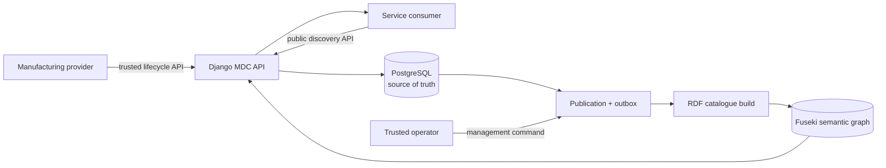
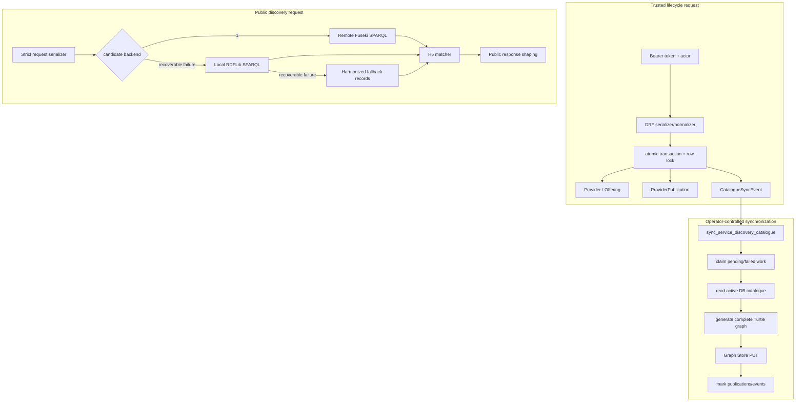
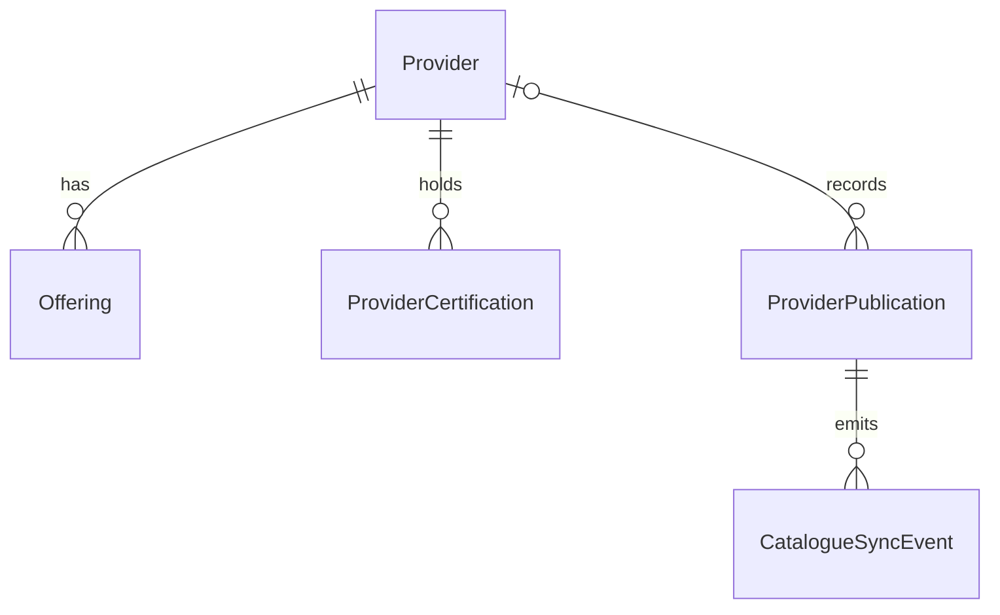
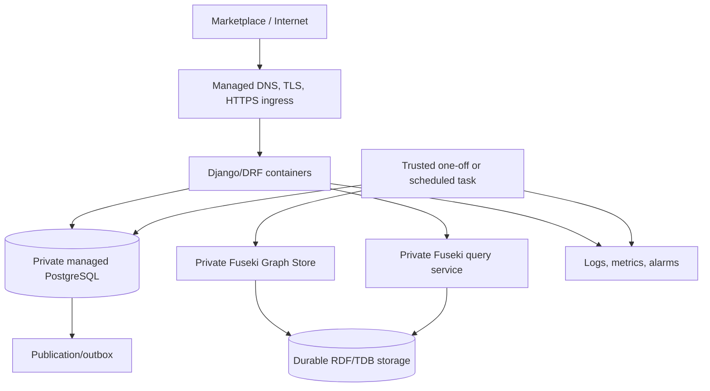

# MaaSAI MaaS Dynamic Catalogue (MDC)

## Comprehensive Implementation Report and User Manual

**Document status:** Current implementation baseline and operating manual

**As of:** 9 September 2026

**Audited repository commit:** `bbd71f8d395afa024d641ac10a41523e66abd669`

**Contract version:** `1.0`

**Audience:** Project managers, provider integrators, consumer integrators, developers, testers, and operators

> **Current-source rule.** This manual describes behavior verified in the application code, tests, data, and accepted Phase 2 and Phase 3 evidence at the audited commit. Older reports and the repository README explain useful history, but they do not override current URL routing, serializers, services, models, or production settings.

## Table of contents

1. [Executive Summary](#1-executive-summary)
2. [MaaSAI/MDC Context and Terminology](#2-maasaimdc-context-and-terminology)
3. [Problem Statement and Original Requirements](#3-problem-statement-and-original-requirements)
4. [Scope and Design Principles](#4-scope-and-design-principles)
5. [Architecture Evolution — From Week 1 to Current State](#5-architecture-evolution--from-week-1-to-current-state)
6. [Current Architecture](#6-current-architecture)
7. [Repository Structure and Main Components](#7-repository-structure-and-main-components)
8. [Data Model and Persistence](#8-data-model-and-persistence)
9. [Provider Data, Controlled Vocabulary, and Flexible Custom Fields](#9-provider-data-controlled-vocabulary-and-flexible-custom-fields)
10. [Tasowheel Pilot](#10-tasowheel-pilot)
11. [H1–H9 Harmonization and Evidence Fidelity](#11-h1h9-harmonization-and-evidence-fidelity)
12. [Development History and Milestones](#12-development-history-and-milestones)
13. [Current API Strategy](#13-current-api-strategy)
14. [Complete Current API Reference](#14-complete-current-api-reference)
15. [End-to-End Provider Registration Walkthrough](#15-end-to-end-provider-registration-walkthrough)
16. [Updating an Existing Provider Safely](#16-updating-an-existing-provider-safely)
17. [Offering Creation and Updating](#17-offering-creation-and-updating)
18. [Consumer Service Discovery](#18-consumer-service-discovery)
19. [Postman Testing Manual — Step by Step](#19-postman-testing-manual--step-by-step)
20. [Reproducing the P3.4 Validation](#20-reproducing-the-p34-validation)
21. [Reproducing the P3.5 End-to-End Validation](#21-reproducing-the-p35-end-to-end-validation)
22. [RDF and Fuseki Explained](#22-rdf-and-fuseki-explained-for-non-semantic-web-readers)
23. [Security and Safety Model](#23-security-and-safety-model)
24. [Current Deployment and Operations](#24-current-deployment-and-operations)
25. [Troubleshooting Guide](#25-troubleshooting-guide)
26. [Current Limitations](#26-current-limitations)
27. [Future Development](#27-future-development)
28. [AWS Migration/Readiness Plan](#28-aws-migrationreadiness-plan)
29. [Glossary](#29-glossary)
30. [Appendices](#30-appendices)

---

## 1. Executive Summary

The MaaSAI MaaS Dynamic Catalogue is a working API-first pilot for publishing manufacturing-provider capabilities and finding providers against structured service requests. The implementation has moved beyond static demonstration files: PostgreSQL is the operational source of truth, trusted lifecycle APIs validate and persist provider data, and a transactional outbox records semantic synchronization work. RDF and Apache Jena Fuseki form a derived semantic query layer. The public discovery endpoint uses the same deterministic matching semantics whether candidates came from remote Fuseki, local RDF, or the harmonized fallback catalogue.

The current canonical public API consists of three unversioned paths:

- `GET /api/health`
- `GET /api/catalog/filters`
- `POST /api/service-discovery/search`

The JSON contract identifies itself with `"contract_version": "1.0"`. There is no current `/api/v1` route. A retained `POST /api/catalog/search` path belongs to the legacy Week 1 contract and is not the integration target for new clients.

Trusted providers and operators use a separate lifecycle surface:

- `POST /api/provider-publication/validation`
- `POST /api/provider-publication`
- `GET` and `PATCH /api/providers/{provider_id}`
- `GET` and `POST /api/providers/{provider_id}/offerings`
- `GET` and `PATCH /api/offerings/{offering_id}`

The trusted boundary uses a bearer service token. Mutating requests require `X-MDC-Actor-Id`. Updates use strong ETags and optimistic concurrency through the canonical `If-Match` header; the deployed Vercel pilot also accepts `X-MDC-If-Match` as a temporary transport compatibility header. A missing precondition returns `428`, a stale revision returns `412`, and malformed preconditions return `400`.

Every accepted lifecycle write runs in a database transaction. It changes the provider or offering, records a `ProviderPublication`, and creates one or more `CatalogueSyncEvent` outbox rows. It does not call Fuseki inside the request transaction. A trusted operator later runs the Django synchronization command, which rebuilds RDF from the complete active PostgreSQL catalogue and replaces the configured Fuseki default graph. This separation protects request latency, makes failures durable and retryable, and preserves PostgreSQL as the authoritative state.

The current hosted pilot uses Django on Vercel and managed PostgreSQL on Neon. The accepted P3.5 proof used an external Fuseki instance reached through a temporary Cloudflare Quick Tunnel. Vercel-side semantic synchronization remained disabled; graph writes came from a trusted operator environment. That tunnel arrangement is validation infrastructure, not the intended permanent production topology.

Phase 3 is complete. P3.4 recorded `45 passed`, `0 failed` across the deployed lifecycle flow. It left a controlled provider and two offerings in PostgreSQL with pending outbox work. P3.5 then processed the four publications and five events (`selected=4; succeeded=4; failed=0; noop=0; events=5`), measured `731` Fuseki triples, and proved that the controlled provider appeared in deployed canonical discovery. P3.6 supplies a future AWS-readiness plan; no AWS migration has yet occurred.

The pilot is intentionally bounded. It has no Marketplace frontend or Marketplace identity integration, no public synchronization endpoint, no route-sequencing engine, no pricing or quotation engine, no live capacity scheduler, and no CAD/2D/3D geometry analysis. Those are possible future work rather than current claims.

### 1.1 How to use this manual

| Reader | Start here | What to use |
|---|---|---|
| Lay reader or project manager | Sections 1–6, 10, 12, and 26–29 | Purpose, architecture, evidence, limitations, roadmap, and terms |
| Marketplace/consumer integrator | Sections 13–14 and 18 | Public URL policy, filter contract, discovery payloads, and results |
| Trusted provider integrator | Sections 9 and 14–17 | Publication rules, authentication, ETags, registration, and updates |
| Tester/Postman user | Sections 19–21 and Appendix C–D | Ordered HTTP tests and accepted P3.4/P3.5 reproduction |
| MDC developer/operator | Sections 6–8, 11–12, and 20–25 | Code map, persistence, matching, synchronization, security, and recovery |
| AWS/platform engineer | Sections 23–24 and 27–28 | Current boundary, configuration, cleanup, migration, cutover, and rollback |

> **New CMM consumer integration.** Start with only `GET /api/health`, `GET /api/catalog/filters`, and `POST /api/service-discovery/search` unless a separate trusted lifecycle integration is explicitly agreed. The provider lifecycle routes are a distinct authenticated integration surface and must not be added to a consumer client by default.

---

## 2. MaaSAI/MDC Context and Terminology

MaaSAI is the project context in which manufacturers need to describe capabilities in a form that software can validate, exchange, and search. The MDC is the catalogue component. It translates provider statements such as “we produce spur gears from alloyed carburizing steel” into controlled, machine-readable records while retaining room for provider-specific facts that are not yet standardized.

A **provider** is an organization that publishes manufacturing capability. An **offering** is one provider's capability within one controlled service category and part family. For example, a provider can have one offering for `precision_gears`/`gear` and another for `precision_shafts`/`shaft`.

A **consumer** submits a service-discovery request. The request selects a service category, part family, and part type, then optionally supplies family-specific, type-specific, and generic requirements. MDC returns compatible active offerings with an overall match status, score, and public capability explanations.

The **harmonized contract** is the current controlled representation shared by provider publication, PostgreSQL projection, RDF generation, and discovery. A **controlled vocabulary** is an enumerated list or structural rule enforced by serializers, such as the valid relationship between `precision_gears` and `gear`. **Custom fields** are explicitly bounded JSON extension areas; they preserve facts without silently redefining controlled fields.

**PostgreSQL** is the operational source of truth: it owns current provider/offering state and durable publication/outbox history. **RDF** is a graph representation derived from that database. **Fuseki** is the RDF server queried with SPARQL. **SPARQL** retrieves candidate records; the H5 matcher then applies the same request interpretation and scoring used by local fallbacks.

An **ETag** is a strong quoted revision fingerprint returned with a provider or offering read. A client sends it back in `If-Match` before a PATCH. This prevents one editor from unknowingly overwriting a newer edit. The **outbox** is the set of durable `CatalogueSyncEvent` rows written in the same transaction as domain changes. It is a queue of semantic work, not a public HTTP endpoint.

The **pilot** is the verified current deployment and data flow. **Production settings** means Django's hardened configuration profile; it does not mean every pilot dependency is already a permanent enterprise platform. **Future AWS readiness** refers to the P3.6 plan and recommendations, not a completed cloud migration.

### 2.1 Relationship to the Cloud MaaS Marketplace

The **Cloud MaaS Marketplace (CMM)** is the intended external user and integration context for provider onboarding and consumer discovery. MDC supplies the catalogue APIs and matching behavior; the current pilot does not implement the CMM user interface, Marketplace login, or end-user identity journey.

On the consumer side, CMM can read the current controlled choices from `/api/catalog/filters` and submit canonical discovery requests. On the provider side, a separately agreed integration can validate, register, and update provider records through the trusted lifecycle surface. The pilot protects that surface with a shared bearer token, actor attribution, and ETags. A later CMM integration should replace or front the shared-token boundary with Marketplace identity and per-provider authorization without changing PostgreSQL persistence or publication semantics.

---

## 3. Problem Statement and Original Requirements

Manufacturing descriptions arrive with uneven terminology, different levels of evidence, and substantial provider-specific detail. A useful catalogue has to support exact facts without converting assumptions into claims. It also needs to let consumers ask a consistent question across providers and understand why an offering matched, partially matched, or remained unknown.

The original pilot therefore needed to:

1. represent companies, services, part families, part types, materials, processes, certifications, dimensions, quality, batch, and delivery facts;
2. keep evidence provenance and confidence distinct from capability value;
3. accept useful provider extensions without weakening controlled keys;
4. produce deterministic search results with explicit unknown handling;
5. express the catalogue as RDF for semantic retrieval;
6. expose stable APIs for consumers and trusted provider lifecycle clients;
7. evolve from seed files to durable persistence without losing matching parity;
8. deploy a safe pilot while keeping a path to stronger identity and infrastructure.

Tasowheel supplied the main evidence-rich pilot. Precipart and controlled demo providers broadened the matching and data-shape tests. The project deliberately avoided inventing facts when source material was incomplete. Support and evidence states such as `candidate_requiring_confirmation`, `not_confirmed`, and `unknown` make uncertainty explicit.

Early requirements and examples used a Week 1 schema, including `service_type` and `/api/v1` examples. Those artifacts record the project's evolution. Current integrations must use `service_category`, `part_family`, and `part_type` at the unversioned canonical paths listed in Section 13.

---

## 4. Scope and Design Principles

The current scope is provider lifecycle plus deterministic capability discovery. The design follows these principles:

- **One operational authority.** PostgreSQL owns current state; YAML is bootstrap/evidence material and RDF is a rebuildable projection.
- **Evidence before inference.** Confirmed, public, curated, and unknown statements retain their provenance and confidence.
- **Strict core, flexible edges.** Controlled identities and search keys are validated; custom JSON namespaces carry non-standard facts.
- **Safe writes.** Authentication, actor attribution, validation, row locks, transactions, duplicate checks, and optimistic concurrency guard lifecycle mutations.
- **Durable integration.** The outbox commits with the domain change. Remote graph work can fail or retry without rolling back an already accepted provider edit.
- **Backend parity.** Remote Fuseki, local RDFLib, and harmonized fallback records feed the same H5 matcher.
- **Small public surface.** Public responses omit internal backend status, evidence/provenance diagnostics, database keys, and outbox details.
- **Operationally gated features.** Provider validation, publication, demo routes, and graph synchronization are independent settings.
- **Portable domain behavior.** Hosting can change without changing public paths, payloads, controlled vocabulary, or match semantics.

Out of scope are user-facing Marketplace screens, end-user authentication, automated public graph writes, manufacturing route planning, quotation, scheduling, geometry extraction, and permanent AWS infrastructure. Section 26 states these limitations and Sections 27–28 describe possible and planned work.

---

## 5. Architecture Evolution — From Week 1 to Current State

The system evolved through controlled increments rather than a single replacement.

| Stage | Source and runtime | API/data focus | Lasting result |
|---|---|---|---|
| Week 1 / A–D | Static YAML and early Django modules | Demonstrate catalogue search and provider data | Proved the concept; left historical `service_type`, `/api/v1`, and legacy route material |
| H1 | Registry code | Controlled category/family/type vocabulary | One canonical vocabulary and relationship validation |
| H2 | Publication serializer and normalizer | Provider/offering identifiers and evidence shape | Deterministic normalized provider publications |
| H3 | Parallel harmonized YAML | Migrate facts without destroying originals | Auditable bridge from early records to current schema |
| H4 | Search request/response contracts | Consumer selection, grouped requirements, policy | Strict current service-discovery contract |
| H5 | Local matcher | Evidence-aware match, score, unknown policy | Deterministic matching semantics |
| H6 | RDF generator | Harmonized data mapped to graph triples | Rebuildable semantic representation |
| H7 | RDFLib/SPARQL | Local semantic candidate retrieval | Search parity against local RDF |
| H8 | Fuseki | Remote SPARQL candidate retrieval | External semantic backend path |
| H9 | Alignment adapters and gates | Remote/local/YAML equality | One public result independent of retrieval backend |
| Phase 2 M1–M6 | Stabilized repository and Vercel preparation | Harmonize tests/data, API, docs, deployment | Clean, deployable public pilot baseline |
| M7.1–M7.2 | Django ORM and managed PostgreSQL | Persistence foundation, import, DB repository | PostgreSQL became operational source of truth |
| M7.3–M7.4 | Trusted lifecycle API | Validate/read/register/update provider and offering | Complete controlled CRUD-like lifecycle without delete |
| M7.5–M7.6 | Transactional outbox and external exposure gates | Fuseki sync, production safety | Operator-controlled semantic publishing and hardened API |
| Phase 3 P3.0–P3.5 | Vercel + Neon + external Fuseki validation | Deploy, enable, validate, synchronize, discover | Accepted end-to-end pilot proof |
| Phase 3 P3.6 | Planning evidence | AWS migration readiness | Future plan only; migration not executed |

Three distinctions prevent historical material from being mistaken for current behavior:

1. The current paths are defined in `backend/apps/api/urls.py`, not old prose.
2. The current public JSON schema is defined by the service-discovery serializers and public response builder, not the legacy catalogue serializer.
3. PostgreSQL is the authoritative operational state, and operator synchronization builds the remote Fuseki default graph from active database providers and offerings. Runtime continuity also includes local RDFLib and harmonized-YAML fallback paths; those paths can reflect generated or curated fallback artifacts rather than a fresh database read. YAML remains bootstrap, regression-test, and fallback material and does not become authoritative.

---

## 6. Current Architecture

### 6.1 Plain-language view



A provider submits structured capabilities. Django checks identity, evidence, vocabulary, authentication, and concurrency, then commits state and synchronization work to PostgreSQL. A trusted operator publishes a full RDF projection to Fuseki. Consumers post discovery requests to the public endpoint. Candidate retrieval and deterministic matching happen behind that single endpoint.

### 6.2 Technical request and synchronization view



The discovery order is exact: remote Fuseki plus H5 first, local RDFLib plus H5 second, harmonized fallback records plus H5 third. Fallback occurs for classified recoverable backend failures. If every backend fails, the API returns a redacted `503` rather than fabricating a successful empty result.

### 6.3 Trust boundaries

| Boundary | Audience | Controls | Data exposed |
|---|---|---|---|
| Public health/filters/discovery | Consumer and monitoring clients | Strict method and serializer rules; HTTPS in production | Public contract only |
| Trusted lifecycle | Approved provider integration/operator | Bearer token, actor for writes, feature flags, ETag on PATCH | Provider lifecycle projection; no internal UUIDs/outbox rows |
| Database | Application and controlled operators | Managed credentials, transactions, ORM constraints | Authoritative state and history |
| Semantic sync | Trusted operator process | Feature flag, graph endpoint validation, optional Basic authentication | Full generated RDF graph |
| Demo API | Local development | `DEBUG` or `MDC_DEMO_API_ENABLED`; disabled by default in production | Diagnostics and non-persistent previews |

### 6.4 Deployment view

The currently validated pilot places Django on Vercel and PostgreSQL on Neon. Remote search uses a configured Fuseki query endpoint. P3.3/P3.5 graph validation used a temporary Cloudflare Quick Tunnel to make an operator-managed Fuseki service reachable. Vercel production had `MDC_CATALOG_SYNC_ENABLED=False`, so the serverless runtime held no responsibility for graph mutation. P3.6 recommends an AWS topology for a later migration but does not change the present architecture.

---

## 7. Repository Structure and Main Components

| Path | Responsibility |
|---|---|
| `backend/config/` | Django base/local/production settings, database URL parsing, root routes, WSGI/ASGI |
| `backend/apps/api/urls.py` | Active public and trusted API route table |
| `backend/apps/api/views/` | Current health, filters, lifecycle, and discovery request handlers |
| `backend/apps/api/service_discovery_*_serializers.py` | Strict current provider-publication and consumer-search contracts |
| `backend/apps/api/public_contract.py` | Reduces internal match output to the public discovery response |
| `backend/apps/api/lifecycle_security.py` | Bearer auth, actor extraction, ETag precondition parsing |
| `backend/apps/providers/models.py` | Provider, offering, certification, publication, and outbox ORM models |
| `backend/apps/providers/provider_lifecycle_*` | Read projection, ETag, registration, and update services |
| `backend/apps/providers/service_discovery_db_repository.py` | Reads the active operational catalogue from PostgreSQL |
| `backend/apps/providers/catalogue_sync_service.py` | Claims outbox work, builds RDF, performs Graph Store PUT, finalizes state |
| `backend/apps/search/` | Request normalization, H5 matcher, SPARQL/Fuseki retrieval, backend fallback |
| `backend/apps/ontology/` | H1 registry, RDF mappings/generation, generation commands |
| `backend/apps/demo/` | Local-only guarded demonstration and diagnostic endpoints |
| `backend/tests/` | Contract, security, persistence, matching, RDF, Fuseki, synchronization, and route safety tests |
| `data/curated/service_discovery/providers/` | Harmonized provider evidence and bootstrap/fallback inputs |
| `data/generated/` | Generated RDF artifacts; build output rather than operational authority |
| `ontologies/` | Ontology/profile/shape locations; current top-level TTL placeholders need future completion |
| `scripts/` | Deployment smoke, P3.2–P3.5 validation, Fuseki load/verification, catalogue validation |
| `docs/Phase_2/`, `docs/Phase_3/` | Accepted milestone decisions and verification evidence |
| `docs/Partner_API/` | Partner guidance; current lifecycle guide is useful, while older examples require source checking |

The root `README.md` remains an early Week 1 introduction. It describes YAML-led behavior and older `/api/v1` paths. It is historical context, not a current API specification. Likewise, `backend/apps/api/views.py` retains legacy view code, but `backend/apps/api/views/__init__.py` imports only `catalog_search` from it; current handlers live under `backend/apps/api/views/`.

---

## 8. Data Model and Persistence

### 8.1 Entity relationship



### 8.2 Operational entities

**Provider** uses an internal UUID primary key and an external unique `provider_id`. It stores `provider_name`, `country`, lifecycle `status` (`draft`, `active`, `suspended`, or `archived`), `custom_provider_fields`, `publication_metadata`, and timestamps.

**Offering** uses an internal UUID and a unique external `offering_id`. It belongs to a provider and stores its name, service category, part family, support status, supported part-type evidence, family/type/generic capability maps, custom offering/capability maps, active flag, stable sequence index, and timestamps. Deleting a provider would cascade to offerings, though the current API exposes no delete operation.

**ProviderCertification** belongs to a provider and stores controlled certification code, source type, confidence, optional source note, a flag distinguishing omitted from explicitly null notes, and sequence index. `(provider, code)` is unique.

**ProviderPublication** is durable lifecycle history. It stores the external provider snapshot, operation (`create` or `update`), state (`received`, `validation_failed`, `validated`, `persisted`, `sync_pending`, `synced`, `sync_failed`, or `rejected`), contract version, submitted and normalized payloads, actor external ID, errors, and lifecycle times. Its provider foreign key may become null while the external snapshot remains.

**CatalogueSyncEvent** is the transactional outbox. Each row identifies its publication, entity type (`provider` or `offering`), external entity ID, operation (`upsert` or `delete`), processing state (`pending`, `processing`, `succeeded`, or `failed`), attempt count, redacted failure record, and processing times. An index on state and creation time supports ordered claims.

### 8.3 Transaction rules

Registration validates the full publication before entering an atomic write. A successful new provider is active, its certifications and offerings are created in deterministic order, a create publication becomes `sync_pending`, and provider/offering outbox events are committed with it. The generated offering identity is `{provider_id}_{service_category}`. A confirmed duplicate provider returns `409`; an integrity race is handled without leaving partial history.

Provider PATCH locks the provider row, merges only allowed fields, revalidates the complete state, replaces supplied list/object fields, rewrites certifications when supplied, and creates a provider event. Offering creation locks the parent provider to allocate a stable next sequence. Offering PATCH locks both provider and offering, preserves identity/category/family/sequence, revalidates the merged offering, touches the provider revision, and creates an offering event.

### 8.4 Read projections

Trusted reads use external IDs and intentionally omit database UUIDs, timestamps, sequence indexes, publications, and outbox details. A provider GET includes core fields, custom fields, metadata, certifications, and offering summaries. Offering list/detail returns complete lifecycle projections. Trusted lifecycle reads can represent non-active provider states and inactive offerings for management. By contrast, the discovery database repository reads only active providers and active offerings.

### 8.5 Revision fingerprints

Strong ETags are quoted SHA-256 digests derived from entity type, external ID, and the stored `updated_at` revision. Creating or editing an offering also updates the parent provider revision, so a previously read provider ETag becomes stale when its offering collection changes. ETags are opaque: clients must store and replay them, not calculate or edit them.

---

## 9. Provider Data, Controlled Vocabulary, and Flexible Custom Fields

### 9.1 Controlled selections

The H1 registry currently permits these category/family relationships:

| Service category | Part family | Part types |
|---|---|---|
| `precision_gears` | `gear` | `spur_gear`, `helical_gear`, `bevel_gear`, `worm_gear`, `crown_gear` |
| `precision_shafts` | `shaft` | `plain_shaft`, `stepped_shaft`, `splined_shaft`, `worm_shaft`, `hollow_shaft` |
| `precision_metal_parts` | `metal_part` | `block`, `plate`, `bracket`, `bushing`, `roller`, `collar` |

Current material values are `steel`, `alloyed_carburizing_steel`, `stainless_steel`, `aluminum`, `titanium`, and `nickel_alloy`. Processes include `machining`, `turning`, `milling`, `hobbing`, `gear_shaping`, `deburring`, `hard_turning`, `grinding`, `tooth_grinding`, `gear_grinding`, `gear_cutting`, `surface_grinding`, `heat_treatment`, `turn_mill`, and `inspection`. Certifications include `ISO9001_2015`, `ISO14001_2015`, `ISO_TS_16949_partial`, `APQP`, `aerospace_traceability`, and `full_traceability`.

These lists are implementation-controlled and are also returned by `GET /api/catalog/filters`. A consumer should populate selection controls from that endpoint rather than maintain a divergent private copy.

### 9.2 Evidence and support

An offering's top-level `support_status` and each supported part type may be `confirmed`, `candidate_requiring_confirmation`, or `unknown`. Evidence `source_type` values are `provider_confirmed`, `public_web`, `curated`, and `not_confirmed`. Confidence values are `declared`, `publicly_confirmed`, `curated`, `inferred`, and `unknown`.

The serializer enforces meaningful evidence pairs. For example, `provider_confirmed` can accompany a declared provider claim, while `not_confirmed` must use `unknown` confidence. This stops an absence of evidence from being represented as a confident manufacturing promise.

### 9.3 Capability namespaces

Provider publications divide capability facts into:

- `family_capabilities`, such as gear module, shaft length, or a metal-part bounding box;
- `part_type_capabilities`, keyed by a controlled part type for facts specific to that type;
- `generic_capabilities`, such as materials, processes, batch size, delivery, certifications, tolerance, quality, or weight;
- `custom_capability_fields`, for non-standard capability facts that the matcher does not interpret;
- `custom_offering_fields`, for non-capability offering metadata;
- `custom_provider_fields`, for provider-level extensions.

Custom fields do not create new searchable controlled properties by themselves. A future registry/serializer/matcher/RDF change is required before a custom fact becomes a canonical search criterion. Sensitive-looking keys, owned identity keys, route keys, and price-related structural shortcuts are rejected rather than accepted into the controlled publication contract.

### 9.4 Identity ownership

The client chooses `provider_id`, which must follow the lower snake-case identifier rules. The server owns offering identity using `{provider_id}_{service_category}`. Clients must not supply `offering_id`, `facility_id`, `material_id`, or `grade_id`. Provider identity, offering identity, service category, and part family are immutable through PATCH. To prevent silent semantic movement, create a separate offering rather than trying to change an existing offering's controlled identity.

---

## 10. Tasowheel Pilot

Tasowheel is the primary evidence-rich pilot provider. Its source material demonstrated why MDC needs both controlled properties and explicit evidence fidelity. The catalogue records gear and shaft capabilities without treating missing facts as negative facts.

The harmonized evidence includes a batch range of 100–2,000, gear module range 0.3–10, a retained raw diametral-pitch statement, outside-diameter capability of 10–450 mm, approximate part weight up to 200 kg, DIN gear quality down to class 4, and lead time of 8–12 weeks. Material grades and certifications are retained with their source context. No surface-finish or tolerance value is invented where source evidence did not establish one.

Confirmed gear subtypes include spur, helical, bevel, and worm gears. Confirmed shaft types include splined, plain, and hollow shafts. A public-web shaft-length statement of 500 mm is represented with its public evidence scope. Candidate and unknown distinctions keep broader catalogue possibilities from being mistaken for provider-confirmed production capability.

The pilot also tested an important negative boundary: manufacturing route sequencing was excluded from the current publication and search contracts. Process capabilities can be matched, but an ordered routing plan is not available through v1 contract semantics. This distinction is maintained in serializers, tests, documentation, and the future-work plan.

Tasowheel evidence amendments were applied across H1–H8: source facts were corrected in controlled records, RDF ordering and explicit-null behavior were preserved, and both local and remote SPARQL reconstruction maintained evidence scope. The result is a provider record that exercises dimensional, material, process, quality, delivery, certification, and uncertainty behavior across all retrieval backends.

---

## 11. H1–H9 Harmonization and Evidence Fidelity

| Gate | Purpose | Verified implementation outcome |
|---|---|---|
| H1 | Service-discovery registry | One controlled category/family/type vocabulary, capability scopes, and relationship rules |
| H2 | Provider publication contract | Strict provider/offering schema, server-owned offering IDs, evidence metadata, deterministic normalization |
| H3 | Harmonized provider YAML | Parallel migration preserved auditable source material while providing current-shaped records |
| H4 | Consumer contract | Strict search selection, grouped requirements, policy defaults, and response validation |
| H5 | Matcher | Deterministic `full_match`, `partial_match`, and `unknown_match`; `any`/`all`/`score_only`, unknown policy, score filtering |
| H6 | RDF generation | Stable IRIs, sequence and explicit-null fidelity, normalized ordering, complete catalogue projection |
| H7 | Local SPARQL | RDFLib reconstruction feeds the same matcher with request-scoped records and evidence intact |
| H8 | Remote SPARQL | Fuseki candidate retrieval and graph execution preserve H7 semantics |
| H9 | Alignment/readiness | Remote Fuseki, local RDF, and harmonized-record paths return equal public results for the gate scenarios |

H5 treats primary selection separately from optional capability evaluation. Service category and family are hard candidate filters; requested part-type support and submitted requirements determine status and score. `optional_match_mode: any` marks the internal optional policy satisfied when no optional criteria exist or at least one evaluation is matched or partially matched. `all` marks it satisfied only when every submitted optional criterion is matched, or none exist. `score_only` always marks it satisfied and leaves comparison to the score.

The optional mode computes the internal boolean `optional_policy_satisfied`; it does **not** remove a candidate by itself, and public response shaping does not expose that boolean. Candidate removal occurs when `unknown_policy: reject_unknown` rejects unknown requested part-type or requirement evidence and/or when `minimum_score` excludes a result below the configured 0–1 threshold. `keep_as_unknown` retains unknown evidence for explanation.

The public response renames the internal attribute collections to `matched_capabilities`, `unmatched_capabilities`, and `unknown_capabilities`. It deliberately omits internal retrieval status, warnings, evidence/provenance diagnostics, and query interpretation. H9 verified result equality after this public shaping, not merely that each backend returned some candidates.

Evidence fidelity is a cross-layer property. Provider statements first retain source and confidence during normalization; database JSON and certification columns preserve them; RDF emits reconstructable values and ordering; SPARQL adapters rebuild request-scoped provider records; H5 evaluates those records. A value must survive the whole chain before a remote match can be considered equivalent to a direct match.

---

## 12. Development History and Milestones

### 12.1 Early implementation A–D

The Week 1 work established a Django repository, seed provider data, a first catalogue search, and early ontology/search modules. It was useful exploratory work, but its README, `service_type` request field, and `/api/v1` examples are historical. Later phases retained a legacy search path for compatibility while building the harmonized surface beside it.

### 12.2 Harmonization H1–H9

H1–H5 defined the controlled vocabulary, publication, consumer contract, and matcher. Evidence amendments corrected Tasowheel facts and uncertainty. H6 emitted harmonized RDF. H7 and H8 added local and remote SPARQL retrieval. Fidelity amendments made sequence, null, evidence, and normalization behavior reconstructable. H9 established the three-backend alignment and endpoint readiness gates summarized in Section 11.

### 12.3 Phase 2

Phase 2 first audited the repository and reconciled code, data, tests, and API documentation. It established a clean Git baseline, stabilized the public contract, prepared and made the first Vercel deployment, and rectified stale API documentation. M7 then added durable lifecycle architecture:

- M7.1 created the Django/PostgreSQL foundation and models.
- M7.2 imported harmonized data into PostgreSQL, added the DB repository, and passed a managed PostgreSQL validation gate.
- M7.3 added trusted validation and provider/offering reads.
- M7.4 added provider registration and provider/offering updates with transactions, outbox records, and ETags.
- M7.5 added full-catalogue RDF generation from PostgreSQL and operator-controlled Fuseki synchronization.
- M7.6 hardened feature flags, security behavior, production routes, and exposure readiness.

The M7.6 accepted technical baseline was 64/64 focused tests, 98/98 managed-PostgreSQL tests, 537 full-suite tests (528 passed and 9 skipped), and 230 H1–H9 tests (225 passed and 5 skipped).

### 12.4 Phase 3

P3.0 accepted the completed M7 release. P3.1 established the Vercel/Neon deployment baseline with 3 providers, 4 offerings, and 5 certifications while lifecycle writes and demos were disabled. P3.2 enabled the trusted lifecycle pilot in stages and exercised controlled writes. P3.3 validated real Fuseki synchronization and the deployed remote-query path.

P3.4 ran the deployed provider lifecycle script: 45 assertions passed and none failed. Its controlled provider increased the durable baseline to 5 providers, 8 offerings, 9 publications, and 11 events. Four P3.4 publications and five events were intentionally pending for semantic synchronization.

P3.5 processed that real pending work. Four publications succeeded, five events succeeded on their first attempt, the graph reached 731 triples, and deployed canonical search returned the controlled provider. P3.6 produced the AWS migration-readiness plan. No Marketplace UI was built and no AWS migration was performed.

Milestone state is therefore:

```text
P3.0 COMPLETE
P3.1 COMPLETE
P3.2 COMPLETE
P3.3 COMPLETE
P3.4 COMPLETE
P3.5 COMPLETE
P3.6 COMPLETE
PHASE 3 COMPLETE
```

---

## 13. Current API Strategy

The API uses stable, unversioned canonical paths and reports the payload contract separately as `contract_version: "1.0"`. New clients must not prefix canonical routes with `/api/v1`. This policy lets infrastructure routing remain simple while serializers explicitly identify the data contract.

There are four route groups:

1. **Canonical public:** health, filters, and service discovery. These need no lifecycle token.
2. **Trusted lifecycle:** validation, registration, provider read/update, and offering list/create/read/update. These require the shared pilot bearer token; writes also require actor attribution.
3. **Legacy:** `POST /api/catalog/search`, retained for the older `service_type` contract. It is not the route documented for new consumers.
4. **Demo:** `/api/demo/*`, available when `DEBUG` or `MDC_DEMO_API_ENABLED` is true. Production defaults the feature off and then returns `404` for all demo paths. The two apparent graph-mutation demo routes return `501` and do not mutate RDF.

HTTP methods are exact. Calling a current path with a method it does not support returns `405`. URL paths do not use a trailing slash in the route definitions shown here. Clients should use the exact paths to avoid framework redirect behavior, especially for requests with bodies.

Errors use a JSON `error` object with a stable code where the current view emits one. Common meanings are `400` invalid input/actor/precondition syntax, `401` trusted authentication required, `403` a lifecycle feature disabled, `404` entity or disabled-demo route absent, `409` duplicate identity, `412` stale ETag, `428` missing precondition, and `503` unavailable authentication configuration, persistence, or all discovery backends.

| Surface | Methods and paths | Intended client |
|---|---|---|
| Public | `GET /api/health`, `GET /api/catalog/filters`, `POST /api/service-discovery/search` | Monitoring and manufacturing consumers |
| Trusted provider | validation/publication plus provider and offering GET/POST/PATCH routes | Approved service/provider integration |
| Legacy | `POST /api/catalog/search` | Existing Week 1 compatibility only |
| Demo | `/api/demo/*` | Local demonstrations; hidden in production by default |

---

## 14. Complete Current API Reference

### 14.1 Public endpoints

#### `GET /api/health`

No authentication. Success `200`:

```json
{
  "contract_version": "1.0",
  "status": "ok",
  "service": "maasai-mdc"
}
```

#### `GET /api/catalog/filters`

No authentication. Success `200` returns `contract_version` plus five arrays (`service_categories`, `part_families`, `materials`, `processes`, and `certifications`) and a `part_types` object keyed by part family. Values are derived from the current registry and are the supported consumer selections. This compact structural excerpt uses one real item per collection; the live response includes every registered item:

```json
{
  "contract_version": "1.0",
  "service_categories": [
    {
      "value": "precision_metal_parts",
      "label": "Precision metal parts",
      "part_family": "metal_part"
    }
  ],
  "part_families": [
    {
      "value": "metal_part",
      "label": "Metal part",
      "service_category": "precision_metal_parts"
    }
  ],
  "part_types": {
    "metal_part": [
      {
        "value": "bracket",
        "label": "Bracket"
      }
    ]
  },
  "materials": [
    {
      "value": "steel",
      "label": "Steel"
    }
  ],
  "processes": [
    {
      "value": "milling",
      "label": "Milling"
    }
  ],
  "certifications": [
    {
      "value": "ISO9001_2015",
      "label": "ISO 9001:2015"
    }
  ]
}
```

#### `POST /api/service-discovery/search`

No authentication. Requires JSON. A minimal valid body is:

```json
{
  "request_id": "req_manual_001",
  "consumer_id": "consumer_manual",
  "service_category": "precision_gears",
  "part_family": "gear",
  "part_type": "spur_gear"
}
```

Omitted requirements default to empty objects and policy defaults to `any`, `keep_as_unknown`, and no minimum score. A valid request returns `200`; an invalid controlled value, relationship, scope, duplicate requirement, forbidden field, or unknown key returns `400`. If every runtime backend fails, the response is a redacted `503`.

Public success shape:

```json
{
  "contract_version": "1.0",
  "request_id": "req_manual_001",
  "service_category": "precision_gears",
  "part_family": "gear",
  "part_type": "spur_gear",
  "result_count": 1,
  "results": [
    {
      "provider_id": "tasowheel",
      "provider_name": "Tasowheel Oy",
      "offering_id": "tasowheel_precision_gears",
      "offering_name": "Precision gears",
      "service_category": "precision_gears",
      "part_family": "gear",
      "match": {
        "status": "full_match",
        "score": 1.0
      },
      "matched_capabilities": [],
      "unmatched_capabilities": [],
      "unknown_capabilities": []
    }
  ]
}
```

The example result illustrates schema and a known provider; actual count, order, score, and capability arrays depend on current data and request criteria. The external response does not echo `consumer_id` and does not expose backend choice, warnings, evidence records, provenance, or internal query interpretation.

### 14.2 Trusted validation and registration

#### `POST /api/provider-publication/validation`

Requires `Authorization: Bearer <token>`. Actor is not needed because validation is non-mutating. When `MDC_PROVIDER_VALIDATION_ENABLED` is false, returns `403`. A valid publication returns `200` with `contract_version`, `valid: true`, and `normalized_payload`. An invalid publication returns `400`, `valid: false`, and validation details. Authentication failure returns `401`; required authentication with no configured server token returns `503`. No Provider, Offering, Certification, Publication, or SyncEvent row is changed.

#### `POST /api/provider-publication`

Requires bearer authentication and `X-MDC-Actor-Id`. When `MDC_PROVIDER_PUBLICATION_ENABLED` is false, returns `403`. New registration returns `201`; an existing `provider_id` returns `409` with code `provider_already_exists`. Invalid payload/actor returns `400`; a redacted persistence failure returns `503`.

Typical success:

```json
{
  "contract_version": "1.0",
  "status": "accepted",
  "operation": "create",
  "provider_id": "manual_test_provider_20260909",
  "publication_id": "<publication-uuid>",
  "publication_status": "sync_pending",
  "sync_status": "pending",
  "offering_ids": [
    "manual_test_provider_20260909_precision_metal_parts"
  ]
}
```

### 14.3 Trusted provider resource

#### `GET /api/providers/{provider_id}`

Requires bearer authentication. Returns `200` and a strong `ETag` header. The body contains `contract_version`, provider identity/name/country/status, custom fields, publication metadata, certifications, and offering summaries. Unknown provider returns `404`; missing/bad token returns `401`; required authentication with no server-side token configured returns `503`.

#### `PATCH /api/providers/{provider_id}`

Requires bearer authentication, actor, and a current strong ETag. Canonical precondition header is `If-Match`; the Vercel pilot also accepts `X-MDC-If-Match`. Allowed body fields are `provider_name`, `country`, `status`, `certifications`, `publication_metadata`, and `custom_provider_fields`. Supplied collection/object fields replace their previous values. `provider_id` and `offerings` are rejected.

Success returns `200`, a new ETag, and an accepted update result with publication/outbox state. Missing precondition returns `428`; stale returns `412`; malformed, weak, wildcard, list, conflicting canonical/compatibility values, or invalid payload returns `400`; missing provider returns `404`; authentication returns `401` or auth-configuration `503`; a disabled publication feature returns `403`.

### 14.4 Trusted offering resources

#### `GET /api/providers/{provider_id}/offerings`

Requires bearer authentication. Returns `200` with `contract_version`, `provider_id`, and full offering projections. Unknown provider returns `404`; authentication returns `401` or auth-configuration `503`. Individual list items do not carry independent HTTP ETag headers; read the selected offering detail before PATCH.

#### `POST /api/providers/{provider_id}/offerings`

Requires bearer authentication and actor. The body is a complete offering without provider/owned identity. The server derives `offering_id`. Success returns `201`, accepted update metadata, the new `offering_id`, and a strong ETag for the newly created offering. A client may retain this ETag or GET the offering immediately before PATCH. Duplicate category-derived identity returns `409` with `offering_already_exists`; unknown provider returns `404`; invalid body returns `400`; authentication returns `401` or auth-configuration `503`; a disabled publication feature returns `403`.

#### `GET /api/offerings/{offering_id}`

Requires bearer authentication. Returns `200`, a strong `ETag`, and the full offering projection: contract version, provider ID, offering ID/name, controlled category/family/support, supported part types, capability maps, custom maps, and `is_active`. Unknown offering returns `404`; authentication returns `401` or auth-configuration `503`.

#### `PATCH /api/offerings/{offering_id}`

Requires bearer authentication, actor, and current ETag. Allowed fields are `offering_name`, `support_status`, `supported_part_types`, `family_capabilities`, `part_type_capabilities`, `generic_capabilities`, `custom_offering_fields`, `custom_capability_fields`, and `is_active`. Provider, offering identity, service category, and part family are immutable. Success returns `200` and a new offering ETag. Possible errors are `400`, `401`, `403`, `404`, `412`, `428`, and auth-configuration/write-unavailable `503`.

### 14.5 Authentication failure behavior

If lifecycle auth is required but the server has no configured service token, trusted routes return `503` with `trusted_lifecycle_auth_unavailable`. Missing or incorrect credentials return `401` with `trusted_lifecycle_auth_required` and a `WWW-Authenticate: Bearer` header. Comparisons use constant-time checking. Actor values are stripped, length-bounded, and reject control characters.

Representative current error envelope:

```json
{
  "contract_version": "1.0",
  "error": {
    "code": "trusted_lifecycle_auth_required",
    "message": "Trusted provider lifecycle authentication is required."
  }
}
```

### 14.6 Guarded demo endpoints

These routes are part of the deployed URL table but are intentionally hidden in production unless explicitly enabled:

| Method | Path | Purpose when enabled |
|---|---|---|
| GET | `/api/demo/health` | Demo readiness |
| GET | `/api/demo/service-discovery/backend-status` | Backend configuration summary |
| GET | `/api/demo/service-discovery/fuseki-smoke-test` | Non-mutating Fuseki diagnostic |
| POST | `/api/demo/service-discovery/regenerate-rdf` | Returns `501`; mutation not implemented |
| POST | `/api/demo/service-discovery/reload-fuseki` | Returns `501`; mutation not implemented |
| POST | `/api/demo/provider-publication/preview` | Non-persistent publication preview |
| GET | `/api/demo/provider-publication/state` | In-memory demo state |
| POST | `/api/demo/provider-publication/simulate-update` | In-memory simulation |

Production defaults `MDC_DEMO_API_ENABLED=False`, and the decorator raises `404` before executing these views. They are not partner lifecycle APIs.

### 14.7 Retained legacy endpoint

`POST /api/catalog/search` remains wired to the old `catalog_search` view and legacy local catalogue behavior. Its `service_type` contract is retained compatibility material. It does not represent the current harmonized consumer API and must not be used to validate new integration work. There is no `/api/v1` equivalent of the current API.

### 14.8 Integration detail and implementation map

This matrix completes the per-endpoint integration fields. “No body” means clients must not invent JSON for a GET. Full request examples are cross-referenced to avoid maintaining divergent copies.

| Endpoint | Required inputs and example | Success response | Operational/error notes | Primary implementation |
|---|---|---|---|---|
| `GET /api/health` | Public; `Accept`; no body/path parameter | Exact `200` JSON in 14.1 | `405` for wrong method | `views/get_views.py::health` |
| `GET /api/catalog/filters` | Public; `Accept`; no body | `200`: contract plus six controlled structures (five arrays and a family-keyed `part_types` mapping) | Use returned values for client controls | `views/get_views.py::catalog_filters`, H1 registry |
| `POST /api/service-discovery/search` | Public JSON; fields/examples in 14.1 and 18 | `200`: exact public response shape in 14.1 | `400` invalid; `503` all backends failed | `views/post_views.py::service_discovery_search`, search serializer, public contract |
| `POST /api/provider-publication/validation` | Validation flag; bearer; publication in 15.1 | `200`: `{contract_version, valid, message, warnings, normalized_payload}` | Non-mutating; `400` invalid/contract, `401`, `403`, auth-config `503` | `views/post_views.py`, publication serializer/normalizer |
| `POST /api/provider-publication` | Publication flag; bearer, actor, JSON; 15.1 | `201`: accepted create response in 14.2 | Atomic; `400`, `401`, `403`, duplicate `409`, redacted `503` | post view, `register_provider` |
| `GET /api/providers/{provider_id}` | Bearer; external path ID; no body | `200` + ETag: contract, core provider fields, certifications, offering summaries | Includes lifecycle states; `401`, `404`, auth-config `503` | `views/get_views.py`, lifecycle repository |
| `PATCH /api/providers/{provider_id}` | Publication flag; bearer, actor, strong precondition; body in 16/C.2 | `200` + new ETag: accepted update with IDs/publication/sync state | Replace supplied collections; `400`, `401`, `403`, `404`, `412`, `428`, `503` | post view, provider patch serializer/write service |
| `GET /api/providers/{provider_id}/offerings` | Bearer; provider path ID; no body | `200`: `{contract_version, provider_id, offerings}` with full projections | List items have no HTTP ETag; `401`, `404`, `503` | `views/get_views.py`, lifecycle repository |
| `POST /api/providers/{provider_id}/offerings` | Publication flag; bearer, actor; body in 17/C.3 | `201`: accepted result plus `offering_id`; new offering ETag | Server owns ID; `400`, `401`, `403`, `404`, `409`, `503` | post view, offering create serializer/write service |
| `GET /api/offerings/{offering_id}` | Bearer; external path ID; no body | `200` + ETag: contract and full offering projection | Includes inactive records; `401`, `404`, `503` | `views/get_views.py`, lifecycle repository |
| `PATCH /api/offerings/{offering_id}` | Publication flag; bearer, actor, strong precondition; body in 17/C.4 | `200` + new ETag: accepted update plus `offering_id` | Identity/category/family immutable; `400`, `401`, `403`, `404`, `412`, `428`, `503` | post view, offering patch serializer/write service |

Every accepted write result uses `status: "accepted"`, `operation`, `provider_id`, a dynamic `publication_id`, `publication_status: "sync_pending"`, `sync_status: "pending"`, and `offering_ids`. Offering create/update also supplies `offering_id`. Sync status describes durable work at response time; it does not claim that Fuseki already contains the change.

---

## 15. End-to-End Provider Registration Walkthrough

### 15.1 Prepare a unique valid publication

Use a unique lower-snake provider ID when a clean `201` is required:

```json
{
  "contract_version": "1.0",
  "provider_id": "manual_test_provider_20260909",
  "provider_name": "Manual Test Provider",
  "country": "Finland",
  "certifications": [
    {
      "code": "ISO9001_2015",
      "source_type": "provider_confirmed",
      "confidence": "declared"
    }
  ],
  "publication_metadata": {
    "source_type": "provider_confirmed",
    "confidence": "declared"
  },
  "custom_provider_fields": {
    "test_run": "manual_20260909"
  },
  "offerings": [
    {
      "service_category": "precision_metal_parts",
      "offering_name": "Manual precision metal parts",
      "part_family": "metal_part",
      "support_status": "confirmed",
      "supported_part_types": [
        {
          "part_type": "bracket",
          "support_status": "confirmed",
          "source_type": "provider_confirmed",
          "confidence": "declared"
        }
      ],
      "family_capabilities": {},
      "part_type_capabilities": {},
      "generic_capabilities": {
        "materials": [
          {
            "material": "steel",
            "available_grades": [],
            "source_type": "provider_confirmed",
            "confidence": "declared"
          }
        ],
        "processes": [
          {
            "process": "milling",
            "delivery_mode": "in_house",
            "source_type": "provider_confirmed",
            "confidence": "declared"
          }
        ]
      },
      "custom_offering_fields": {},
      "custom_capability_fields": {}
    }
  ]
}
```

### 15.2 Validate without changing state

POST the payload to `/api/provider-publication/validation` with bearer authorization. A `200` and `valid: true` proves contract validity and shows the normalized projection. It does not reserve the ID or write history. Correct every validation error before registration.

### 15.3 Register with attribution

POST the same payload to `/api/provider-publication` with bearer authorization and `X-MDC-Actor-Id: manual:provider-onboarding`. A new record returns `201`, provider and offering external IDs, a publication UUID, `publication_status: sync_pending`, and `sync_status: pending`. Store the IDs but do not expose the token in logs or exported collections.

### 15.4 Verify operational state

GET `/api/providers/manual_test_provider_20260909`, then list `/api/providers/manual_test_provider_20260909/offerings`. Confirm the values and store the provider ETag. At this point PostgreSQL contains the operational state and outbox work. The provider is not guaranteed to be in Fuseki until a trusted operator synchronizes it.

### 15.5 Publish semantically

An operator with database and Graph Store access runs `sync_service_discovery_catalogue` in an environment where `MDC_CATALOG_SYNC_ENABLED=True`. This is outside the provider HTTP session. After success, direct SPARQL and canonical discovery can prove the provider is present. Section 21 describes the accepted proof sequence.

---

## 16. Updating an Existing Provider Safely

1. GET `/api/providers/{provider_id}` with the lifecycle token.
2. Store the exact quoted ETag response header.
3. Prepare a PATCH containing only intended mutable fields.
4. Send bearer auth, actor ID, JSON content headers, and `If-Match: <stored-etag>`.
5. On `200`, replace the stored ETag with the response ETag.
6. On `412`, GET the provider again, compare the new representation with the intended change, and consciously retry using the new ETag.

Example provider PATCH:

```json
{
  "provider_name": "Manual Test Provider Oy",
  "status": "active",
  "custom_provider_fields": {
    "test_run": "manual_20260909",
    "reviewed": true
  }
}
```

PATCH is partial at the top level, but any supplied collection replaces that collection. Sending `"certifications": []` clears certifications; sending a list replaces them in the supplied order. Omitted fields remain unchanged. Sending `provider_id` or `offerings` is a `400` contract error.

The `428` response means no concurrency token was supplied. A `412` means the supplied token once described a valid representation but no longer matches. A `400` can mean the token itself is malformed or that `If-Match` and `X-MDC-If-Match` conflict. Never solve `412` by blindly fetching and resending: inspect the intervening change so optimistic concurrency still protects user intent.

---

## 17. Offering Creation and Updating

Create an offering under its provider. Do not put provider or offering ID in the JSON:

```json
{
  "contract_version": "1.0",
  "service_category": "precision_shafts",
  "offering_name": "Manual precision shafts",
  "part_family": "shaft",
  "support_status": "confirmed",
  "supported_part_types": [
    {
      "part_type": "hollow_shaft",
      "support_status": "confirmed",
      "source_type": "provider_confirmed",
      "confidence": "declared"
    }
  ],
  "family_capabilities": {
    "length_mm": {"max": 500},
    "outer_diameter_mm": {"max": 60}
  },
  "part_type_capabilities": {
    "hollow_shaft": {
      "inner_diameter_mm": {"min": 10}
    }
  },
  "generic_capabilities": {
    "materials": [
      {
        "material": "steel",
        "available_grades": [],
        "source_type": "provider_confirmed",
        "confidence": "declared"
      }
    ],
    "processes": [
      {
        "process": "turning",
        "delivery_mode": "in_house",
        "source_type": "provider_confirmed",
        "confidence": "declared"
      }
    ]
  },
  "custom_offering_fields": {},
  "custom_capability_fields": {}
}
```

POST to `/api/providers/{provider_id}/offerings`. The expected identity is `{provider_id}_precision_shafts`. A successful response carries a strong ETag for this newly created offering. Because identity is category-derived and unique, repeating the request returns `409`. A client can retain the response ETag, while this manual's safer demonstration flow lists the collection and GETs `/api/offerings/{offering_id}` immediately before PATCH to capture the current offering ETag.

Example offering PATCH:

```json
{
  "offering_name": "Manual precision shafts — reviewed",
  "generic_capabilities": {
    "materials": [
      {
        "material": "steel",
        "available_grades": [],
        "source_type": "provider_confirmed",
        "confidence": "declared"
      },
      {
        "material": "stainless_steel",
        "available_grades": [],
        "source_type": "provider_confirmed",
        "confidence": "declared"
      }
    ],
    "processes": [
      {
        "process": "turning",
        "delivery_mode": "in_house",
        "source_type": "provider_confirmed",
        "confidence": "declared"
      },
      {
        "process": "grinding",
        "delivery_mode": "in_house",
        "source_type": "provider_confirmed",
        "confidence": "declared"
      }
    ]
  },
  "custom_capability_fields": {
    "review_note": "Requires commercial confirmation"
  },
  "is_active": true
}
```

Send it to `/api/offerings/{offering_id}` with actor and ETag. Supplied capability maps replace the corresponding stored maps. The service revalidates the complete merged offering, so an apparently small patch cannot leave an invalid category/family/type combination. Setting `is_active: false` removes the offering from discovery after semantic synchronization but keeps it available to trusted lifecycle reads.

---

## 18. Consumer Service Discovery

### 18.1 Complete gear request

```json
{
  "request_id": "req_gear_001",
  "consumer_id": "consumer_001",
  "service_category": "precision_gears",
  "part_family": "gear",
  "part_type": "spur_gear",
  "requirements": {
    "part_family_specifications": {
      "module": {"exact": 2.0},
      "diametral_pitch": {"min": 10, "max": 20},
      "number_of_teeth": {"exact": 40},
      "outside_diameter_mm": {"max": 120},
      "gear_quality": {"standard": "DIN", "max_class": 5},
      "tolerance_mm": {"max": 0.02}
    },
    "part_type_specifications": {
      "face_width_mm": {"exact": 20}
    },
    "generic_requirements": {
      "materials": ["alloyed_carburizing_steel"],
      "processes": ["hobbing"],
      "batch_size": 500,
      "delivery": {"max_weeks": 12},
      "certifications": ["ISO9001_2015"]
    }
  },
  "match_policy": {
    "optional_match_mode": "any",
    "unknown_policy": "keep_as_unknown",
    "minimum_score": null
  }
}
```

This fixture is validated by current serializer and backend-alignment tests. It exercises dimensional, quality, material, process, batch, delivery, and certification matching.

### 18.2 Hollow-shaft request

```json
{
  "request_id": "req_shaft_001",
  "consumer_id": "consumer_001",
  "service_category": "precision_shafts",
  "part_family": "shaft",
  "part_type": "hollow_shaft",
  "requirements": {
    "part_family_specifications": {
      "length_mm": {"max": 500},
      "outer_diameter_mm": {"max": 60},
      "tolerance_mm": {"max": 0.01}
    },
    "part_type_specifications": {
      "inner_diameter_mm": {"min": 10},
      "wall_thickness_mm": {"exact": 5}
    }
  }
}
```

### 18.3 P3.5 controlled-provider search

```json
{
  "request_id": "req_p35_controlled_provider",
  "consumer_id": "p35_validation",
  "service_category": "precision_metal_parts",
  "part_family": "metal_part",
  "part_type": "bracket"
}
```

After P3.5 synchronization, deployed canonical search returned `p34_api_validation_provider` and its `p34_api_validation_provider_precision_metal_parts` offering for this controlled selection.

### 18.4 Reading results

`full_match` means the requested part type is confirmed and every submitted criterion matched. `partial_match` means the part type is confirmed but at least one submitted criterion is partial, unmatched, or unknown. `unknown_match` means the requested part type itself is unknown or only a candidate requiring confirmation. With `keep_as_unknown`, unknown evidence remains explainable. `reject_unknown` excludes a candidate whose requested part type or any requested criterion is unknown. A result array can be empty; this is a valid `200`, distinct from a `503` backend failure.

The three `optional_match_mode` values are `any`, `all`, and `score_only`. They compute an internal policy-satisfaction flag but never filter candidates on their own. The public response omits that internal flag. Use `minimum_score` for score-based exclusion and `unknown_policy: reject_unknown` for unknown-evidence exclusion.

Matched, unmatched, and unknown capability arrays explain public decisions without exposing internal evidence records. Scores allow stable ranking and optional thresholding; they are not quotations, probabilities, capacity commitments, or quality guarantees. Consumers should show uncertainty to users and confirm commercial/manufacturing suitability directly with the provider.

---

## 19. Postman Testing Manual — Step by Step

### 19.1 Why Postman fits this test

Postman can group the public and trusted HTTP calls, keep the pilot URL and secret token in an environment, run JavaScript assertions, and pass IDs and ETags from one request to the next. This makes the lifecycle sequence repeatable for a tester who does not need to run Django locally.

Install the current Postman desktop application or use an approved Postman workspace. Create a private workspace and do not publish or export an environment that contains the lifecycle token. The collection tests the deployed REST boundary. It does not replace the trusted operator command used for RDF/Fuseki synchronization.

### 19.2 Create the environment

Create an environment named **MDC Pilot — Private** with these variables:

| Variable | Initial value | Sensitive/current value guidance |
|---|---|---|
| `base_url` | `https://maasai-mdc-v1.vercel.app` | Safe pilot URL; replace after a future AWS cutover |
| `lifecycle_token` | `<YOUR_TRUSTED_LIFECYCLE_TOKEN>` | Mark sensitive; place the real value only in the private current value |
| `actor_id` | `postman:provider-lifecycle-tester` | Non-secret attribution |
| `provider_id` | `postman_provider_20260909_001` | Change suffix for each clean registration run |
| `provider_etag` | empty | Captured by test script |
| `provider_stale_etag` | empty | Captured before a successful PATCH |
| `offering_id` | empty | Captured from registration/create response |
| `offering_etag` | empty | Captured by test script |
| `offering_stale_etag` | empty | Captured before a successful PATCH |

Select the environment before sending requests. Environment-variable syntax is `{{base_url}}`, not shell-variable syntax. Use the same unique `provider_id` consistently inside the registration payload; Postman resolves variables inside raw JSON strings.

### 19.3 Exact headers

For public GET requests use `Accept: application/json`. For trusted requests use:

```http
Authorization: Bearer {{lifecycle_token}}
Content-Type: application/json
Accept: application/json
```

Omit `Authorization` on public requests and on the deliberate anonymous test. For writes add:

```http
X-MDC-Actor-Id: {{actor_id}}
```

For provider PATCH use canonical HTTP semantics where the client/proxy preserves them:

```http
If-Match: {{provider_etag}}
```

The current Vercel validation used this compatibility header:

```http
X-MDC-If-Match: {{provider_etag}}
```

Use one precondition header, not conflicting values. The same rules apply to `{{offering_etag}}`. `If-Match` remains the portable contract; `X-MDC-If-Match` is a temporary Vercel transport workaround.

### 19.4 Reusable Postman scripts

Paste the appropriate script into the **Tests** or current **Post-response** script tab.

Status and contract check:

```javascript
pm.test("HTTP 200", function () {
  pm.response.to.have.status(200);
});

pm.test("Contract version 1.0", function () {
  const body = pm.response.json();
  pm.expect(body.contract_version).to.eql("1.0");
});
```

Capture a provider ETag while retaining a stale copy for a later negative test:

```javascript
pm.test("Provider read returned ETag", function () {
  pm.response.to.have.status(200);
  const etag = pm.response.headers.get("ETag");
  pm.expect(etag).to.be.a("string").and.not.empty;
  pm.environment.set("provider_etag", etag);
  pm.environment.set("provider_stale_etag", etag);
});
```

Capture an offering ETag:

```javascript
pm.test("Offering read returned ETag", function () {
  pm.response.to.have.status(200);
  const etag = pm.response.headers.get("ETag");
  pm.expect(etag).to.be.a("string").and.not.empty;
  pm.environment.set("offering_etag", etag);
  pm.environment.set("offering_stale_etag", etag);
});
```

Capture returned IDs after registration:

```javascript
pm.test("Provider registered", function () {
  pm.response.to.have.status(201);
  const body = pm.response.json();
  pm.expect(body.contract_version).to.eql("1.0");
  pm.expect(body.provider_id).to.eql(pm.environment.get("provider_id"));
  pm.expect(body.offering_ids).to.be.an("array").that.is.not.empty;
  pm.environment.set("offering_id", body.offering_ids[0]);
});
```

After a successful provider PATCH, assert that the revision changed and store it:

```javascript
pm.test("Provider updated with a new revision", function () {
  pm.response.to.have.status(200);
  const oldEtag = pm.environment.get("provider_stale_etag");
  const newEtag = pm.response.headers.get("ETag");
  pm.expect(newEtag).to.be.a("string").and.not.empty;
  pm.expect(newEtag).not.to.eql(oldEtag);
  pm.environment.set("provider_etag", newEtag);
});
```

Known error assertion template:

```javascript
const expectedStatus = 412;
const expectedCode = "provider_precondition_failed";

pm.test(`HTTP ${expectedStatus}`, function () {
  pm.response.to.have.status(expectedStatus);
});

pm.test(`Error code ${expectedCode}`, function () {
  const body = pm.response.json();
  pm.expect(body.error).to.be.an("object");
  pm.expect(body.error.code).to.eql(expectedCode);
});
```

Change both constants for the particular negative test. Current codes to assert include `trusted_lifecycle_auth_required` (`401`), `provider_already_exists` or `offering_already_exists` (`409`), `concurrency_precondition_required` (`428`), and `provider_precondition_failed` or `offering_precondition_failed` (`412`).

Search-result check:

```javascript
pm.test("Controlled provider appears in discovery", function () {
  pm.response.to.have.status(200);
  const body = pm.response.json();
  pm.expect(body.contract_version).to.eql("1.0");
  const providerIds = body.results.map((item) => item.provider_id);
  pm.expect(providerIds).to.include("p34_api_validation_provider");
});
```

### 19.5 Build and run the collection in this exact order

Create a collection named **MDC Provider Lifecycle and Discovery**. The bodies below use the example in Section 15 unless a smaller body is shown.

#### 01 Health

- `GET {{base_url}}/api/health`; `Accept` only.
- Expect `200`, status `ok`, and contract `1.0`.

#### 02 Catalogue filters

- `GET {{base_url}}/api/catalog/filters`; expect `200`, contract `1.0`, five controlled arrays, and the family-keyed `part_types` mapping.
- Assert the chosen values:

```javascript
pm.test("Required controlled values are advertised", function () {
  const body = pm.response.json();
  const serviceCategories = body.service_categories.map(item => item.value);
  const partFamilies = body.part_families.map(item => item.value);
  const metalPartTypes = (body.part_types.metal_part || []).map(item => item.value);

  pm.expect(serviceCategories).to.include("precision_metal_parts");
  pm.expect(partFamilies).to.include("metal_part");
  pm.expect(metalPartTypes).to.include("bracket");
});
```

#### 03 Anonymous lifecycle validation — expect 401

- `POST {{base_url}}/api/provider-publication/validation` with Section 15.1's body.
- Omit authorization; expect `401`, `trusted_lifecycle_auth_required`.

#### 04 Valid provider validation

- Repeat 03 with bearer authorization. Actor is optional because validation does not mutate.
- Expect `200`, `valid: true`, contract `1.0`, and `normalized_payload`.

#### 05 Invalid provider validation

- Use the validation URL and bearer authorization with:

```json
{
  "contract_version": "1.0",
  "provider_id": "bad"
}
```

- Expect `400` and `valid: false`.

#### 06 Register provider

- `POST {{base_url}}/api/provider-publication` with bearer, actor, JSON, and accept headers.
- Use Section 15.1 with `"provider_id": "{{provider_id}}"`.
- On a new ID expect `201` and publication `sync_pending`; use the ID capture script.

#### 07 Duplicate provider — expect 409

- Repeat 06 unchanged; expect `409`, `provider_already_exists`.

#### 08 GET provider and capture ETag

- `GET {{base_url}}/api/providers/{{provider_id}}` with bearer and accept.
- Expect `200`; run the provider ETag capture script.

#### 09 PATCH provider without precondition — expect 428

- `PATCH {{base_url}}/api/providers/{{provider_id}}` with bearer, actor, JSON, and accept, but no ETag header.
- Body: `{"country":"Finland"}`.
- Expect `428`, `concurrency_precondition_required`.

#### 10 PATCH provider with ETag — expect 200

- Repeat with `If-Match: {{provider_etag}}` or the Vercel compatibility header and a real change:

```json
{
  "provider_name": "Postman Provider — reviewed",
  "custom_provider_fields": {
    "source": "postman",
    "reviewed": true
  }
}
```

- Expect `200`; run the provider new-revision script.

#### 11 PATCH provider with stale ETag — expect 412

- Send a valid PATCH with `{{provider_stale_etag}}`, captured before request 10.
- Expect `412`, `provider_precondition_failed`.

#### 12 List offerings

- `GET {{base_url}}/api/providers/{{provider_id}}/offerings` with bearer and accept.
- Expect `200` and the registration offering.

#### 13 Create offering

- `POST {{base_url}}/api/providers/{{provider_id}}/offerings` with trusted write headers.
- Use the `precision_shafts` body from Section 17; expect `201`.
- Store the returned ID:

```javascript
pm.test("Offering created", function () {
  pm.response.to.have.status(201);
  const body = pm.response.json();
  pm.expect(body.offering_id).to.be.a("string").and.not.empty;
  pm.environment.set("offering_id", body.offering_id);
});
```

#### 14 Duplicate offering — expect 409

- Repeat 13 unchanged; expect `409`, `offering_already_exists`.

#### 15 GET offering and capture ETag

- `GET {{base_url}}/api/offerings/{{offering_id}}` with bearer and accept.
- Expect `200`; run the offering ETag capture script.

#### 16 PATCH offering without precondition — expect 428

- `PATCH {{base_url}}/api/offerings/{{offering_id}}` with trusted write headers but no ETag.
- Body: `{"offering_name":"Postman shafts — reviewed"}`.
- Expect `428`, `concurrency_precondition_required`.

#### 17 PATCH offering with ETag — expect 200

- Repeat 16 with `If-Match: {{offering_etag}}` or the compatibility header.
- Expect `200` and a changed ETag. Script:

```javascript
pm.test("Offering updated with a new revision", function () {
  pm.response.to.have.status(200);
  const oldEtag = pm.environment.get("offering_stale_etag");
  const newEtag = pm.response.headers.get("ETag");
  pm.expect(newEtag).to.be.a("string").and.not.empty;
  pm.expect(newEtag).not.to.eql(oldEtag);
  pm.environment.set("offering_etag", newEtag);
});
```

#### 18 PATCH offering with stale ETag — expect 412

- Send a valid patch with `{{offering_stale_etag}}`; expect `412`, `offering_precondition_failed`.

#### 19 Canonical service discovery search

- `POST {{base_url}}/api/service-discovery/search`; lifecycle authorization is not required.
- Use a Section 18 body. Expect `200`, contract `1.0`; for P3.5 use the controlled-provider assertion.

#### 20 Optional legacy/version-path negative checks

- `GET {{base_url}}/api/v1/health` and `POST {{base_url}}/api/v1/service-discovery/search` demonstrate that `/api/v1` is not current and should return `404`.
- `/api/catalog/search` is retained legacy, so do not call it a missing route or send it the current schema.
- In production, `GET {{base_url}}/api/demo/health` should return `404` while demos are disabled.

### 19.6 Reruns, duplicate IDs, and cleanup

Registration and offering creation are intentionally non-idempotent by identity. A second registration for the same provider or a second offering for the same provider/category returns `409`. This proves duplicate protection but prevents requests 06 or 13 from returning a fresh `201` on a full rerun.

For a clean run, change the `provider_id` suffix and clear captured ETag/offering variables. There is no public delete endpoint, so do not invent a cleanup call. Test records should use a recognizable namespace and be retired using an approved operator process or marked inactive through the trusted API when appropriate.

### 19.7 What Postman cannot test or trigger

Postman can prove the REST contract and resulting reads. It cannot safely prove or trigger the internal outbox-to-Fuseki transition because MDC exposes no public synchronization route. P3.5 used the trusted Django management command in an operator environment with database and Graph Store access. The demo `regenerate-rdf` and `reload-fuseki` routes return `501`; they are not synchronization alternatives.

---

## 20. Reproducing the P3.4 Validation

The script `scripts/p34_provider_lifecycle_validation.py` executes a controlled deployed lifecycle flow. It reads the token from `MDC_PROVIDER_LIFECYCLE_SERVICE_TOKEN` without printing it, targets `MDC_P34_BASE_URL` or the pilot URL, and uses `p34_api_validation_provider`. It checks public health/filters; anonymous, invalid, and valid validation; actor enforcement; registration and duplicate protection; provider read/update/stale concurrency; offering list/create/read/update/stale concurrency; and final collection state.

### 20.1 Safe operator procedure

From `mdc-catalog` in a private shell whose environment already contains the required secret:

```powershell
python -m py_compile scripts/p34_provider_lifecycle_validation.py
python scripts/p34_provider_lifecycle_validation.py
```

Do not put a real token on the command line, paste it into a transcript, or use a command that echoes environment values. The repository's canonical local `.env` can be loaded by an approved private process, but its value must never appear in logs. The script mutates managed PostgreSQL through the deployed trusted API and intentionally does not synchronize Fuseki.

### 20.2 Accepted result

```text
P3.4 PROVIDER LIFECYCLE API VALIDATION: PASS
tests_passed=45
tests_failed=0
```

The pre-run baseline was 4 providers, 6 offerings, 5 publications, and 6 sync events, with no P3.4 entities. After the accepted run there were 5 providers, 8 offerings, 9 publications, and 11 events. The controlled provider was active with two offerings. Its four publications comprised one create and three updates, all `sync_pending`; its five events were `pending` with attempt count zero.

The earlier production token could not be retrieved because Vercel represented its value as sensitive. The token was rotated once and the same undisclosed value was configured locally and in Vercel Production, followed by a redeployment. No value was printed or committed. This is historical operating evidence, not a reason to rotate again during routine reproduction.

Equivalent Postman proof is the ordered collection in Section 19. Database counts and outbox states still require read-only operator access. Repeated runs may reuse the controlled provider at the registration step, but later update calls create new publication history, so record a fresh baseline before comparing counts.

---

## 21. Reproducing the P3.5 End-to-End Validation

P3.5 proves causality across the whole data path:

```text
provider exists in PostgreSQL
provider absent from old Fuseki graph and search
        -> trusted sync management command
        -> updated Fuseki graph
        -> direct SPARQL proof
        -> deployed canonical search proof
```

### 21.1 Preconditions and pre-sync evidence

Use `scripts/p35_provider_to_discovery_verify.py` to check the controlled provider, its metal-parts offering, direct Fuseki state, deployed discovery state, and database outbox. Verify script syntax first. Confirm Vercel Production still has `MDC_CATALOG_SYNC_ENABLED=False`. Before synchronization, the controlled provider and offering must be absent from Fuseki and the provider must be absent from the deployed bracket search. This before-state distinguishes real synchronization from a provider already present in the graph.

### 21.2 Trusted synchronization

Run the existing management command only from an approved operator process with managed PostgreSQL and Graph Store configuration. Enable sync for that process only. A typical targeted call is:

```powershell
python backend/manage.py sync_service_discovery_catalogue --limit 4
```

Select only after a read-only baseline proves the four eligible publications are the intended P3.4 set. For stronger targeting, run one approved publication at a time with `--publication-id <publication-uuid>`. The mutually exclusive modes are `--limit`, `--publication-id`, `--rebuild`, and `--recover-stale`; default mode processes up to 100 pending/failed publications. The command mutates the remote graph and publication/outbox states. It must not be exposed as a public web request.

The accepted run reported:

```text
Catalogue synchronization: selected=4; succeeded=4; failed=0; noop=0; events=5.
```

It claimed eligible publications briefly inside database transactions, read the complete active catalogue, generated Turtle, made one whole-graph Graph Store PUT outside the database transaction, then finalized all selected publication/event states. Four publications became `synced`; five events became `succeeded`, each with attempt count one.

### 21.3 Post-sync proof

Run the verification script in its documented post-sync mode, then verify:

```text
Fuseki triples=731
p34_api_validation_provider present in Fuseki
p34_api_validation_provider_precision_metal_parts present in Fuseki
p34_api_validation_provider returned by deployed canonical search
contract_version=1.0
```

Because the provider was created through the deployed lifecycle API and was absent immediately before sync, its later presence in direct SPARQL and deployed canonical discovery proves the intended provider-to-discovery flow.

Vercel synchronization remained disabled throughout. This keeps database/graph credentials and long-running graph replacement out of the serverless request boundary, avoids concurrent automatic publishers, and makes graph changes an observable operator action. AWS migration can later provide a private durable worker without changing the API contract.

---

## 22. RDF and Fuseki Explained for Non-Semantic-Web Readers

PostgreSQL is good at transactional business state: unique IDs, updates, row locks, and durable history. RDF represents the same active catalogue as a graph, which is useful when capabilities, evidence, classifications, and offerings have many relationships. Keeping both is deliberate: the database is authoritative, and the graph can be rebuilt.

An RDF graph consists of triples: subject, predicate, object. A simplified example is:

```text
<provider/p34_api_validation_provider>
    mdc:hasOffering
<offering/p34_api_validation_provider_precision_metal_parts> .
```

Another triple can state that the offering has part family `metal_part`; another can connect it to supported type `bracket`. The implementation namespace is `https://maasai-project.eu/ontology/mdc#`. Provider and offering external IDs are encoded into stable resources so a SPARQL result can be reconstructed into the same records used by H5.

SPARQL is a graph query language. MDC builds a request-scoped query to retrieve credible provider/offering candidates and their relevant capability/evidence nodes. Candidate retrieval does not replace matching: the reconstructed records still go through H5, preserving score and unknown semantics across backends.

Fuseki is the remote SPARQL and Graph Store server. Reads go to a configured query endpoint. Synchronization generates one complete Turtle representation of the active PostgreSQL catalogue and uses a Graph Store PUT to replace the configured graph. Whole-graph replacement avoids a partly updated semantic catalogue, though it requires controlled single-writer operation and a graph sized appropriately for rebuilding.

If remote Fuseki has a recoverable availability problem, discovery tries local RDFLib. If that also has a recoverable problem, it tries harmonized fallback records. Each path still uses H5. This provides continuity but does not make RDF or YAML authoritative. If every backend fails, MDC returns `503` so clients can distinguish infrastructure failure from a legitimate empty catalogue result.

The ontology directory contains the expected core/profile/mapping/shape locations, but the top-level Turtle ontology placeholders are empty at the audited commit. Runtime RDF generation and mappings are implemented in Python and covered by tests. Completing independently consumable ontology artifacts is a documented future maintenance task.

---

## 23. Security and Safety Model

### 23.1 Feature gates

`MDC_PROVIDER_VALIDATION_ENABLED`, `MDC_PROVIDER_PUBLICATION_ENABLED`, `MDC_CATALOG_SYNC_ENABLED`, and `MDC_DEMO_API_ENABLED` separate the main risks. Production defaults all four to false unless explicitly configured. A team can allow trusted validation without writes, allow lifecycle writes without server-side graph mutation, and keep all demo routes hidden.

### 23.2 Authentication and attribution

Trusted lifecycle routes use a shared bearer service token as the pilot boundary. The comparison is constant-time. When required auth is misconfigured on the server, the API fails closed with `503`; it does not silently become public. Mutations require `X-MDC-Actor-Id`, creating an external actor record in publication history. Actor attribution is not authentication by itself.

The shared token is replaceable pilot security, not final multi-tenant Marketplace identity. A permanent integration should use scoped short-lived OAuth/JWT identities, issuer/audience validation, per-provider authorization, revocation, audit principals, and rate policy.

### 23.3 Concurrency, transactions, and outbox

Strong ETags prevent lost updates. Weak validators, wildcard/list forms, oversized or malformed values, and conflicting compatibility/canonical headers are rejected. Database row locks serialize competing changes to the same provider/offering. Validation and all domain/history/event writes occur atomically.

The outbox avoids the dual-write problem. An accepted API call never has to decide whether a simultaneous remote graph call really happened before a timeout. The transaction either commits both business state and durable sync intent or commits neither. The operator can retry failed work. A processing lease lets stale `processing` records be recovered as failed work after the configured interval, default 900 seconds.

### 23.4 Secret handling

The local `.env` is ignored by Git. `DATABASE_URL`, `DJANGO_SECRET_KEY`, `MDC_PROVIDER_LIFECYCLE_SERVICE_TOKEN`, and `SERVICE_DISCOVERY_FUSEKI_PASSWORD` are secrets. Never print them, put them in examples, commit them, embed them in credential-bearing URLs, or export a Postman environment containing them. Vercel may show a stored secret as `[SENSITIVE]`; that means it is not retrievable through the environment pull, not that its value is literally that text.

Graph read/write credentials should live only in approved secret stores and operator runtimes. The current `.env.example` documents the query and Graph Store endpoints but omits the optional `SERVICE_DISCOVERY_FUSEKI_USERNAME` and `SERVICE_DISCOVERY_FUSEKI_PASSWORD` assignments implemented in settings. P3.6 identifies environment-template cleanup as a readiness task.

### 23.5 Production HTTP settings

Django production settings require a secret key and allowed hosts, honor the forwarded HTTPS header, redirect to HTTPS, use secure session/CSRF cookies, and enable HSTS controls. These protections support transport and framework safety. They do not replace API rate limiting, tenant identity, WAF policy, or private service networking.

### 23.6 Remaining pilot boundary

The bearer token authorizes the trusted lifecycle as one service-level principal. It does not independently prove which provider owns a requested `provider_id`. Vercel's public network edge and the temporary external Fuseki tunnel are pilot exposure decisions. Keep graph writes disabled there, restrict token distribution, rotate only through an approved coordinated procedure, monitor lifecycle traffic, and move database/graph services to private networking during the future migration.

---

## 24. Current Deployment and Operations

### 24.1 Stable validated pilot components

- Django/DRF application deployed on Vercel at the pilot base URL.
- Managed Neon PostgreSQL as operational source of truth.
- Public health, filters, and canonical discovery.
- Trusted provider lifecycle enabled for the controlled pilot.
- Remote Fuseki query support plus local RDF/fallback paths.
- Durable publication/outbox records and an operator synchronization command.

### 24.2 Accepted Phase-3 pilot configuration snapshot

The accepted P3.4/P3.5 production validation used this feature and security posture:

```text
MDC_PROVIDER_VALIDATION_ENABLED=True
MDC_PROVIDER_PUBLICATION_ENABLED=True
MDC_PROVIDER_LIFECYCLE_AUTH_REQUIRED=True
MDC_PROVIDER_LIFECYCLE_ACTOR_REQUIRED=True
MDC_PROVIDER_CONCURRENCY_REQUIRED=True
MDC_CATALOG_SYNC_ENABLED=False
MDC_DEMO_API_ENABLED=False
```

This is an accepted Phase-3 evidence snapshot, not a permanent guarantee about a later deployment. Recheck the actual deployment configuration after every environment, platform, credential, or release change. Keep synchronization off in the public application unless a separately approved architecture explicitly changes the operator boundary.

### 24.3 Temporary validation mechanisms

P3.3 and P3.5 used a local/external Fuseki service made reachable through a Cloudflare Quick Tunnel. The endpoint allowed Vercel's discovery runtime to query the updated graph. A Quick Tunnel URL is ephemeral and should not be considered a service-level endpoint. If the tunnel stops or changes, deployed remote Fuseki querying fails and the runtime may fall back; direct P3.5 remote proof will fail until configuration is updated.

After the tunnel is no longer required, remove or replace the temporary Vercel `SERVICE_DISCOVERY_FUSEKI_QUERY_ENDPOINT` and redeploy. Leaving a dead endpoint configured adds avoidable remote-query timeout and fallback delay. Never expose the Fuseki Graph Store endpoint or write credentials through Vercel/public clients. Before long-term production or AWS use, rotate pilot database and Fuseki credentials where appropriate through the approved migration procedure.

### 24.4 Routine operations

1. Keep Vercel production settings explicit and graph sync false.
2. Apply Django migrations to the intended managed database before enabling write behavior.
3. Run public and trusted smoke checks after deployment without logging secret headers.
4. Inspect publication/event state through read-only operator commands.
5. Run graph synchronization from one trusted operator environment.
6. Verify event finalization, graph triple/query evidence, and deployed canonical discovery.
7. Preserve audit evidence without copying credential values.

Relevant configuration names include `DJANGO_SETTINGS_MODULE`, `DJANGO_SECRET_KEY`, `DJANGO_DEBUG`, `DJANGO_ALLOWED_HOSTS`, `DATABASE_URL`, lifecycle feature/auth/actor/concurrency settings, `MDC_CATALOG_SYNC_PROCESSING_LEASE_SECONDS`, and the Fuseki query/Graph Store endpoint and optional Basic-auth settings. Appendix B provides the complete grouped list.

### 24.5 Deployment interpretation

Vercel and Neon are the current validated pilot. The temporary tunnel is a validation bridge. None of them should be described as the already completed AWS target. Under P3.6 the application contract, identifiers, matching behavior, PostgreSQL authority, and rebuildable semantic layer remain unchanged while hosting, networking, worker execution, secrets, monitoring, and cutover practices become production-grade.

---

## 25. Troubleshooting Guide

| Symptom | Likely cause | Safe resolution |
|---|---|---|
| P3.4 says lifecycle token is not set | Secret exists in `.env` but was not loaded into that PowerShell process | Load the canonical local environment through a private approved method; verify presence without displaying value; rerun syntax check and script |
| Vercel pull returns `[SENSITIVE]` | Platform prevents retrieval of an existing secret | Do not treat the marker as a token. Use an already authorized local copy or perform one coordinated rotation only when explicitly approved |
| Trusted call returns `401` | Missing/malformed bearer header or token mismatch | Check bearer syntax, selected Postman environment, deployment environment, and redeployment after intentional secret changes; never log the value |
| Trusted call returns `503` with auth unavailable | Production requires auth but the server token is empty | Configure the approved secret in deployment and redeploy; keep the route failed closed |
| Write returns `400` actor required | Actor header omitted, empty, too long, or contains controls | Send a stable non-secret actor identifier within the accepted length |
| PATCH returns `428` | No current precondition header was sent | GET the entity, capture its strong ETag, and send canonical `If-Match` or the Vercel compatibility header |
| PATCH returns `412` | Entity changed after the client read it | GET again, review intervening changes, merge intentionally, and retry with the new ETag |
| PATCH returns `400` for precondition | Weak/list/wildcard/malformed ETag or conflicting headers | Replay the exact quoted strong ETag in one header; do not strip quotes |
| Registration returns `409` | Provider ID already exists | Treat as duplicate protection; choose a unique test ID for a fresh `201` |
| Offering create returns `409` | Provider already has the category-derived offering ID | Update that offering or use a different valid category; IDs cannot be client-overridden |
| Lifecycle route returns `403` | Validation/publication feature flag is disabled | Confirm intended deployment stage; enable only the required flag through change control |
| Fuseki query is unreachable | Endpoint/tunnel down, DNS/TLS failure, or wrong query path | Check non-secret endpoint and service health; restore the service/tunnel and confirm fallback behavior |
| Graph Store returns `401`/`403` | Missing/incorrect Basic credentials or endpoint policy | Correct credentials in the private operator environment; never move write credentials to a public client |
| Sync command says disabled | Sync flag is false in the operator process | Enable it only for the trusted process after checking database and graph targets |
| Events remain `pending` | No worker ran, or command filters excluded them | Inspect counts/selection; run controlled sync and verify final state |
| Events are `failed` | Network, generation, Graph Store, or finalization error | Inspect redacted logs and `last_error`, correct cause, retry eligible work; do not edit rows to claim success |
| Events are stuck `processing` | Operator crashed after claim | Use stale recovery after the lease; it moves stale work to failed for safe retry |
| Test teardown reports database/session trouble | Managed PostgreSQL connection remained open during test cleanup | End stray sessions, confirm the test database, then rerun; never drop production to fix a test |
| Direct remote proof fails after earlier success | Quick Tunnel stopped or URL changed | Restore the authorized tunnel, update query configuration, redeploy if needed, and repeat proof |
| `/api/v1/...` returns `404` | Client copied historical docs | Remove `/v1`; use current canonical route and keep contract version in JSON |
| Current body fails on `/api/catalog/search` | Client called the legacy contract | Use canonical service discovery; reserve legacy `service_type` only for old clients |
| Search returns empty `200` | No active offering satisfies selection/policy | Check filters, relationships, unknown policy, requirements, and graph freshness |
| Search returns `503` | All remote/local/fallback backends failed | Investigate configuration and availability; do not interpret it as “no providers” |

When troubleshooting production, begin with response status/code and non-secret configuration presence. Avoid printing full environments, authorization headers, database URLs, or Graph Store credentials. Preserve the distinction between restoring read availability and authorizing state-changing synchronization.

---

## 26. Current Limitations

The pilot has a strong, verified backend path, but it is not a complete manufacturing marketplace.

- No MaaSAI Marketplace frontend, provider onboarding UI, or end-consumer UI was built in Phase 3.
- The trusted lifecycle uses one shared service bearer token. It is not final Marketplace OAuth/JWT identity, tenant authorization, or provider ownership enforcement.
- There is no public or automatic semantic synchronization endpoint. An operator must process the outbox.
- Whole-graph Graph Store replacement is appropriate for the present small catalogue but may require redesign at larger scale.
- Manufacturing route sequencing and process planning are not queryable in the current contract. A process list is capability evidence, not an ordered route.
- There is no pricing, quotation, commercial availability, or contract engine.
- There is no real-time machine capacity, schedule, inventory, or delivery promise service.
- No CAD, 2D drawing, or 3D geometry ingestion, feature extraction, manufacturability analysis, or automatic requirement derivation is implemented.
- Discovery scores describe contract matching. They are not probabilities, rankings of provider quality, or commercial recommendations.
- The vocabulary covers three current service categories and their controlled part families/types. Custom fields are stored but are not automatically searchable.
- The lifecycle surface has create/read/update but no partner-facing delete. Deactivation is available for offerings; provider lifecycle status can be changed.
- The legacy catalogue route and stale documentation remain in the repository and can confuse clients unless clearly labeled.
- Demo routes remain in the URL table, although production hides them by default and graph-mutation stubs return `501`.
- Standalone ontology Turtle files are placeholders at this commit even though runtime RDF mappings/generation are implemented and tested.
- Vercel, Neon, and the temporary Fuseki/tunnel arrangement are pilot infrastructure. The external semantic endpoint does not yet have a permanent service boundary.
- AWS deployment, private networking, managed worker execution, production observability, backup rehearsal, and cutover have not been executed.

These limitations do not invalidate the accepted P3.4/P3.5 proof. They define what that proof means: a controlled provider can be validated, persisted, synchronized, and found through the deployed API under operator supervision.

---

## 27. Future Development

### 27.1 Planned and credible next steps

The next deployment program should implement the accepted P3.6 AWS migration/readiness plan rather than reopening Phase 3. It should package Django and Fuseki for the selected AWS compute, provision private PostgreSQL and graph networking, move secrets to managed stores, create a trusted sync task, establish logs/metrics/alerts, automate safe delivery, migrate data, rebuild RDF, and run the same end-to-end acceptance before traffic cutover.

Identity should then move from one shared token toward the MaaSAI Marketplace integration's actual trust model. A credible sequence is gateway or application JWT validation, stable subject/organization mapping, per-provider authorization, scoped operations, audit correlation, expiry/revocation, and rate limits. The provider lifecycle payload and persistence semantics can remain stable while the principal becomes stronger.

Provider onboarding can improve without weakening validation: interactive vocabulary discovery, draft validation, clear evidence guidance, conflict-aware editing using ETags, import templates, and review/approval workflow. Documentation cleanup should align the README and partner material with current paths, remove ambiguous legacy examples, add optional Fuseki write-auth variables to the environment template, and complete the ontology artifacts.

Operational maturity should include immutable images, infrastructure as code, database backup/restore drills, a graph rebuild runbook, outbox age/failure dashboards, query-backend availability metrics, structured redacted logs, alarms, synthetic canonical searches, and documented credential rotation.

### 27.2 Ideas that are not implemented

CAD/2D/3D ingestion could later extract dimensions, features, tolerances, materials, and quality requirements for human confirmation. A route-aware planning extension could represent ordered operations, machines, setups, and inspection steps. Capacity and scheduling could use provider-authorized live data. Quotation could combine material, setup, batch, process, quality, logistics, and commercial rules.

Each idea requires a separate domain and safety milestone. Geometry extraction must not silently publish inferred requirements as source facts. Route planning must distinguish capability from a validated production plan. Capacity needs freshness and ownership semantics. Pricing requires commercial authorization, currency/tax validity, and clear non-binding versus binding states. None should be retrofitted into custom fields and advertised as current search functionality.

At greater catalogue scale, the team can evaluate incremental RDF changes, a durable worker queue, read replicas, caching, richer SPARQL indexing, and separate public/private projections. Any optimization must preserve PostgreSQL authority, transactional sync intent, evidence fidelity, deterministic H5 semantics, and redacted public responses.

---

## 28. AWS Migration/Readiness Plan

P3.6 states that the application is ready at the architectural level for AWS, while infrastructure packaging, provisioning, migration, and operational proof remain. The following is the actionable summary of that accepted plan.

### 28.1 Recommended target, not locked product selection



A practical baseline is ECS/Fargate or equivalent container compute for Django, Amazon RDS for PostgreSQL as the simplest managed candidate, containerized Apache Jena Fuseki with persistent storage, ECR for images, an Application Load Balancer or equivalent ingress, Secrets Manager and/or Systems Manager Parameter Store, a VPC with private database/graph paths, and CloudWatch or equivalent observability. These are recommendations. The exact services can change without changing MDC domain architecture.

### 28.2 Preparation gaps

Before cutover, approve production container definitions and a WSGI/ASGI server; codify network, compute, database, Fuseki storage, IAM, secret, ingress, and monitoring resources; define all environment configuration; define the trusted sync task; validate persistent Fuseki storage; rehearse database backup/restore and graph rebuild; implement CI/CD and rollback; and update the environment template for optional graph-write authentication.

Public ingress should terminate TLS. PostgreSQL and Graph Store must not be public. Keep Fuseki query private where practical. Only the sync task should receive graph-write credentials. Do not bake secrets into images. Retain auth, actor, and concurrency requirements. Rotate pilot lifecycle, database, and Fuseki credentials during or after the controlled production cutover.

### 28.3 PostgreSQL migration

For the current pilot scale:

1. Provision AWS PostgreSQL.
2. Apply the repository's Django migrations.
3. Take a final logical Neon backup/export during a controlled write window.
4. Restore with standard PostgreSQL tooling.
5. Compare provider, offering, certification, publication, and event counts.
6. Inspect representative values and history, including the P3.4/P3.5 provider.
7. Point the AWS Django deployment at the new secret `DATABASE_URL`.
8. Run Django checks, trusted reads, ETag behavior, and transaction tests before writes are enabled.

The application uses Django ORM and a standard PostgreSQL URL; it has no Neon-specific schema or SDK dependency. At a future larger scale, a managed replication service can reduce downtime without changing models.

### 28.4 Semantic bootstrap

Do not migrate RDF as the operational authority. Deploy private Fuseki, configure its query endpoint for Django and Graph Store endpoint for the trusted task, then rebuild the complete graph from AWS PostgreSQL. Perform the Graph Store replacement, direct SPARQL proof, triple sanity checks, backend-alignment checks, and canonical search proof. PostgreSQL makes the graph reproducible even if the pilot TDB store is not copied.

### 28.5 Migration sequence and acceptance

| Phase | Action | Exit gate |
|---|---|---|
| AWS-0 | Provision networking, database, application target, Fuseki/storage, secrets, logs | Resources exist privately; pilot untouched |
| AWS-1 | Deploy same MDC release without traffic cutover | Health, filters, discovery, and trusted reads pass |
| AWS-2 | Backup/restore Neon into AWS PostgreSQL | Counts/history, migrations, lifecycle, ETags, and atomic writes pass |
| AWS-3 | Generate RDF from AWS DB and bootstrap AWS Fuseki | Direct SPARQL and canonical AWS search agree |
| AWS-4 | Create/update a controlled provider, process outbox, discover it | Phase 3-style end-to-end proof passes |
| AWS-5 | Point approved traffic to AWS; observe | Error, latency, DB, sync, and semantic health acceptable; rollback ready |
| AWS-6 | Retire Vercel, Neon, and tunnel after observation and approval | Backups retained; credentials rotated; dependencies confirmed unused |

AWS-4 must repeat the proven causal chain: lifecycle write → AWS PostgreSQL → publication/outbox → trusted AWS task → AWS Fuseki → canonical discovery. Public application instances should still have `MDC_CATALOG_SYNC_ENABLED=False`; the task receives explicit enablement and graph credentials.

### 28.6 CI/CD and operations

The target pipeline runs focused and full validation gates, builds an immutable application image, pushes it to the selected registry, deploys a revision, applies migrations as an explicit controlled step, tests health and canonical APIs, and retains the previous revision. Image deployment must not silently perform database import, graph replacement, or outbox processing.

Monitor HTTP status/latency, trusted auth failures, database availability/connections, publication/event age and failures, sync attempt/lease recovery, Fuseki query and Graph Store health, graph size, and synthetic known searches. Back up PostgreSQL according to recovery objectives. Treat Fuseki as rebuildable but still validate storage durability and keep a tested reconstruction runbook.

### 28.7 Cutover and rollback

Before cutover retain a verified Neon export, known-good application commit/image, secure configuration record, old endpoint, and an explicit reconciliation plan. Freeze old writes if needed for final consistency. Change traffic only after AWS-4 passes.

If pre-cutover acceptance fails, continue serving the pilot. If failure occurs after traffic moves, route clients to the known-good pilot and reconcile any writes accepted in the AWS window before another attempt. Do not independently accept writes in both environments without a defined replication/merge mechanism. Fuseki can be rebuilt from the selected authoritative database.

### 28.8 Behavior that must remain stable

Migration preserves the three canonical public routes, absence of a public `/api/v1` surface, contract `1.0`, trusted lifecycle paths and status codes, external IDs, PostgreSQL authority, publication/outbox audit, H1–H9 matching, RDF namespace/generation, operator-only synchronization, and ETag behavior. Cloud relocation is not an API or ontology redesign.

---

## 29. Glossary

| Term | Practical meaning in MDC |
|---|---|
| Active offering | An offering eligible for operational discovery and RDF generation |
| Actor ID | Non-secret external identifier sent with a write and stored for audit attribution |
| API | HTTP interface through which software validates, writes, reads, or searches MDC |
| Canonical route | The current integration path supported by code and tests |
| Catalogue | Structured collection of providers, offerings, and capability evidence |
| Capability | A provider statement about a dimension, material, process, quality, delivery, certification, or related fact |
| CatalogueSyncEvent | Durable outbox row recording graph work caused by a lifecycle write |
| Consumer | Client or organization searching for manufacturing capability |
| Contract version | Payload schema identifier; currently `1.0`, separate from the URL |
| Controlled vocabulary | Enforced list/structure for interoperable categories, types, materials, processes, and certifications |
| ETag | Opaque strong revision fingerprint used to prevent stale updates |
| Evidence confidence | Strength/classification of the source supporting a statement |
| Fuseki | Apache Jena server providing remote SPARQL and Graph Store interfaces |
| Graph Store PUT | Operator action that replaces the configured RDF graph with a complete generated graph |
| H1–H9 | Harmonization gates from registry through cross-backend endpoint alignment |
| H5 matcher | Deterministic engine that evaluates candidate capabilities and unknowns |
| Harmonized record | Provider/offering data using the current controlled schema and evidence model |
| Lifecycle API | Trusted validation, registration, read, and update endpoints |
| Neon | Managed PostgreSQL service used by the current pilot |
| Optimistic concurrency | Update pattern that proceeds only when the client's ETag still matches |
| Outbox | Durable queue written in the same transaction as business state |
| Part family/type | Controlled hierarchy such as `gear` and `spur_gear` |
| Provider | Manufacturing organization publishing capabilities |
| ProviderPublication | Audit/history record for a validated lifecycle create or update |
| RDF | Graph data model expressing facts as subject-predicate-object triples |
| RDFLib | Python RDF engine used for local semantic retrieval fallback |
| Service category | Top-level controlled offering class such as `precision_gears` |
| Source of truth | System whose state is authoritative; PostgreSQL in current MDC |
| SPARQL | Query language used to retrieve RDF graph candidates |
| Sync lease | Time-bound processing claim used to detect and recover crashed sync work |
| Trusted operator | Approved runtime/person with database and Graph Store access to synchronize the catalogue |
| Vercel | Serverless hosting platform for the current Django pilot |

---

## 30. Appendices

### Appendix A — Current Endpoint Matrix

| Method | Path | Audience | Auth/guard | Main success | Important errors/status |
|---|---|---|---|---|---|
| GET | `/api/health` | Public | None | `200` | `405` wrong method |
| GET | `/api/catalog/filters` | Public | None | `200` | `405` |
| POST | `/api/service-discovery/search` | Public | None | `200` | `400` contract; `503` all backends unavailable |
| POST | `/api/provider-publication/validation` | Trusted | Bearer; validation feature | `200` valid | `400`, `401`, `403`, `503` auth unavailable |
| POST | `/api/provider-publication` | Trusted write | Bearer, actor, publication feature | `201` | `400`, `401`, `403`, `409`, `503` |
| GET | `/api/providers/{provider_id}` | Trusted | Bearer | `200` + ETag | `401`, `404`, `503` auth unavailable |
| PATCH | `/api/providers/{provider_id}` | Trusted write | Bearer, actor, strong precondition | `200` + new ETag | `400`, `401`, `403`, `404`, `412`, `428`, `503` |
| GET | `/api/providers/{provider_id}/offerings` | Trusted | Bearer | `200` | `401`, `404`, `503` |
| POST | `/api/providers/{provider_id}/offerings` | Trusted write | Bearer, actor, publication feature | `201` + new offering ETag | `400`, `401`, `403`, `404`, `409`, `503` |
| GET | `/api/offerings/{offering_id}` | Trusted | Bearer | `200` + ETag | `401`, `404`, `503` |
| PATCH | `/api/offerings/{offering_id}` | Trusted write | Bearer, actor, strong precondition | `200` + new ETag | `400`, `401`, `403`, `404`, `412`, `428`, `503` |
| POST | `/api/catalog/search` | Legacy | Legacy behavior | compatibility response | Historical `service_type` contract; not for new clients |
| GET | `/api/demo/health` | Local/demo | Demo gate | demo response | Production `404` |
| GET | `/api/demo/service-discovery/backend-status` | Local/demo | Demo gate | diagnostic | Production `404` |
| GET | `/api/demo/service-discovery/fuseki-smoke-test` | Local/demo | Demo gate | diagnostic | Production `404` |
| POST | `/api/demo/service-discovery/regenerate-rdf` | Local/demo | Demo gate | none | `501`; production `404` |
| POST | `/api/demo/service-discovery/reload-fuseki` | Local/demo | Demo gate | none | `501`; production `404` |
| POST | `/api/demo/provider-publication/preview` | Local/demo | Demo gate | preview | Production `404` |
| GET | `/api/demo/provider-publication/state` | Local/demo | Demo gate | in-memory state | Production `404` |
| POST | `/api/demo/provider-publication/simulate-update` | Local/demo | Demo gate | simulation | Production `404` |

`/admin/` is Django's framework administration surface, not part of the MDC partner/public JSON contract. No public synchronization endpoint and no current `/api/v1` route exist.

### Appendix B — Environment Variables

| Group | Variable | Secret? | Purpose/current note |
|---|---|---:|---|
| Django | `DJANGO_SETTINGS_MODULE` | No | Select base/local/production settings at entrypoint; intentionally absent from `.env.example` |
| Django | `DJANGO_SECRET_KEY` | **Yes** | Required nonempty in production |
| Django | `DJANGO_DEBUG` | No | Local base behavior; production forces false |
| Django | `DJANGO_ALLOWED_HOSTS` | No | Comma-separated accepted hosts |
| Django | `CORS_ALLOWED_ORIGINS` | No | Allowed browser origins |
| Django | `CSRF_TRUSTED_ORIGINS` | No | Trusted CSRF origins |
| Django | `DJANGO_SESSION_COOKIE_SECURE` | No | Production secure-cookie setting |
| Django | `DJANGO_CSRF_COOKIE_SECURE` | No | Production secure-cookie setting |
| Django | `DJANGO_SECURE_SSL_REDIRECT` | No | Production HTTPS redirect |
| Django | `DJANGO_SECURE_HSTS_SECONDS` | No | HSTS duration |
| Django | `DJANGO_SECURE_HSTS_INCLUDE_SUBDOMAINS` | No | HSTS subdomain policy |
| Django | `DJANGO_SECURE_HSTS_PRELOAD` | No | HSTS preload policy |
| Database | `DATABASE_URL` | **Yes** | Full PostgreSQL connection URL in managed environments; empty permits local SQLite |
| Lifecycle | `MDC_DEMO_API_ENABLED` | No | Enables guarded demo surface; production default false |
| Lifecycle | `MDC_PROVIDER_VALIDATION_ENABLED` | No | Enables trusted non-mutating validation |
| Lifecycle | `MDC_PROVIDER_PUBLICATION_ENABLED` | No | Enables trusted lifecycle writes |
| Lifecycle | `MDC_PROVIDER_LIFECYCLE_AUTH_REQUIRED` | No | Requires bearer auth; production default true |
| Lifecycle | `MDC_PROVIDER_LIFECYCLE_SERVICE_TOKEN` | **Yes** | Shared trusted-pilot bearer token |
| Lifecycle | `MDC_PROVIDER_LIFECYCLE_ACTOR_REQUIRED` | No | Requires actor header on writes; production default true |
| Lifecycle | `MDC_PROVIDER_CONCURRENCY_REQUIRED` | No | Requires ETag precondition on PATCH; production default true |
| Sync | `MDC_CATALOG_SYNC_ENABLED` | No | Enables operator graph mutation; production should remain false |
| Sync | `MDC_CATALOG_SYNC_PROCESSING_LEASE_SECONDS` | No | Stale processing lease, default 900 |
| Fuseki | `FUSEKI_BASE_URL` | No | Legacy/general base configuration |
| Fuseki | `FUSEKI_DATASET` | No | Dataset name |
| Fuseki | `FUSEKI_QUERY_ENDPOINT` | No | General query endpoint |
| Fuseki | `FUSEKI_UPDATE_ENDPOINT` | Potentially | General update endpoint; may reveal topology |
| Fuseki | `SERVICE_DISCOVERY_FUSEKI_QUERY_ENDPOINT` | No | H1–H9 remote candidate query endpoint |
| Fuseki | `SERVICE_DISCOVERY_FUSEKI_GRAPH_STORE_ENDPOINT` | Potentially | Graph Store target; keep private even when URL has no credentials |
| Fuseki | `SERVICE_DISCOVERY_FUSEKI_USERNAME` | Potentially | Optional Graph Store Basic username; implemented but missing from template |
| Fuseki | `SERVICE_DISCOVERY_FUSEKI_PASSWORD` | **Yes** | Optional Graph Store Basic password; implemented but missing from template |
| Fuseki | `FUSEKI_TIMEOUT_SECONDS` | No | Query timeout |
| Fuseki | `FUSEKI_SYNC_TIMEOUT_SECONDS` | No | Graph synchronization timeout |
| Validation | `MDC_P34_BASE_URL` | No | Optional P3.4 target override |

Vercel CLI identity variables such as `VERCEL_OIDC_TOKEN` do not belong in the project `.env`. Future AWS should store secrets in Secrets Manager/Parameter Store and inject safe configuration through the deployment task definition.

### Appendix C — Example Payload Catalogue

#### C.1 Provider validation/publication

Use the complete body in Section 15.1 for both validation and registration. Validation uses bearer auth only and is non-mutating. Registration adds actor attribution and creates operational/history/outbox state. Replace `manual_test_provider_20260909` with a unique identifier as needed.

#### C.2 Provider patch

```json
{
  "provider_name": "Manual Test Provider Oy",
  "country": "Finland",
  "status": "active",
  "certifications": [
    {
      "code": "ISO9001_2015",
      "source_type": "provider_confirmed",
      "confidence": "declared"
    }
  ],
  "custom_provider_fields": {
    "reviewed": true
  }
}
```

#### C.3 Offering creation

```json
{
  "contract_version": "1.0",
  "service_category": "precision_gears",
  "offering_name": "Manual precision gears",
  "part_family": "gear",
  "support_status": "confirmed",
  "supported_part_types": [
    {
      "part_type": "spur_gear",
      "support_status": "confirmed",
      "source_type": "provider_confirmed",
      "confidence": "declared"
    }
  ],
  "family_capabilities": {
    "module": {"min": 0.5, "max": 5.0}
  },
  "part_type_capabilities": {},
  "generic_capabilities": {
    "materials": [
      {
        "material": "alloyed_carburizing_steel",
        "available_grades": [],
        "source_type": "provider_confirmed",
        "confidence": "declared"
      }
    ],
    "processes": [
      {
        "process": "hobbing",
        "delivery_mode": "in_house",
        "source_type": "provider_confirmed",
        "confidence": "declared"
      }
    ]
  },
  "custom_offering_fields": {},
  "custom_capability_fields": {}
}
```

#### C.4 Offering patch

```json
{
  "offering_name": "Manual precision gears — reviewed",
  "support_status": "confirmed",
  "generic_capabilities": {
    "materials": [
      {
        "material": "alloyed_carburizing_steel",
        "available_grades": [],
        "source_type": "provider_confirmed",
        "confidence": "declared"
      }
    ],
    "processes": [
      {
        "process": "hobbing",
        "delivery_mode": "in_house",
        "source_type": "provider_confirmed",
        "confidence": "declared"
      },
      {
        "process": "gear_grinding",
        "delivery_mode": "in_house",
        "source_type": "provider_confirmed",
        "confidence": "declared"
      }
    ]
  },
  "is_active": true
}
```

#### C.5 Service discovery

Use Section 18.1 for a complete gear match, Section 18.2 for shaft dimensions, or Section 18.3 for the accepted P3.5 controlled-provider proof. All use `service_category`; the old `service_type` key is invalid for canonical discovery.

### Appendix D — Important Scripts and Commands

Run from `mdc-catalog` unless stated. Commands assume the private environment is already configured and never echo secrets.

| Purpose | Command | State effect |
|---|---|---|
| Django deployment check | `python backend/manage.py check --deploy --settings=config.settings_production` | Read-only, but requires production configuration |
| Compile P3.3 scripts | `python -m py_compile scripts/p33_fuseki_preflight.py scripts/p33_fuseki_verify.py` | Read-only |
| Require remote Fuseki preflight | `python scripts/p33_fuseki_preflight.py --require-remote` | Network read-only |
| Direct P3.3 Fuseki verify | `python scripts/p33_fuseki_verify.py --direct-only` | Network read-only |
| Full P3.3 verify | `python scripts/p33_fuseki_verify.py` | Network read-only |
| Compile/run P3.4 | `python -m py_compile scripts/p34_provider_lifecycle_validation.py` then `python scripts/p34_provider_lifecycle_validation.py` | **Mutates lifecycle DB via API** |
| Compile/P3.5 absent proof | `python -m py_compile scripts/p35_provider_to_discovery_verify.py` then `python scripts/p35_provider_to_discovery_verify.py --expect-absent` | Read-only network/DB checks |
| P3.5 present proof | `python scripts/p35_provider_to_discovery_verify.py` | Read-only network/DB checks |
| Process up to four publications | `python backend/manage.py sync_service_discovery_catalogue --limit 4` | **Mutates Fuseki and outbox/publications** |
| Process one publication | `python backend/manage.py sync_service_discovery_catalogue --publication-id <publication-uuid>` | **Mutates Fuseki and selected history** |
| Full graph rebuild | `python backend/manage.py sync_service_discovery_catalogue --rebuild` | **Replaces graph; does not alter outbox history** |
| Recover stale claims | `python backend/manage.py sync_service_discovery_catalogue --recover-stale` | **DB-only state mutation; no Fuseki call** |
| Import curated providers | `python backend/manage.py import_service_discovery_providers` | **Atomically replaces/imports operational provider data** |
| Generate harmonized RDF artifact | `python backend/manage.py generate_service_discovery_rdf` | Writes generated file, no DB/remote graph mutation |
| Full Django tests | `python backend/manage.py test tests` | Creates/uses test database only |
| Lifecycle-focused tests | `python backend/manage.py test tests.test_provider_publication_validation_api tests.test_provider_detail_api tests.test_provider_lifecycle_write_api` | Test database only |
| Sync-focused tests | `python backend/manage.py test tests.test_catalogue_sync_service tests.test_catalogue_sync_concurrency tests.test_catalogue_sync_recovery` | Test database and mocked transports |

Before any mutating command, record the target database, endpoint presence, expected selection/count, and a rollback/retry plan without displaying credential values. `--rebuild`, `--recover-stale`, `--limit`, and `--publication-id` are mutually exclusive.

### Appendix E — Milestone Status Matrix

| Milestone | Status | Principal evidence |
|---|---|---|
| A–D early pilot | Historical complete | First catalogue, data, Django modules, legacy search |
| H1–H5 | Complete | Registry, publication/search contracts, deterministic matcher |
| H6–H9 | Complete | RDF, local/remote SPARQL, evidence fidelity, backend alignment |
| Phase 2 M1–M6 | Complete | Harmonization, clean baseline, public contract, Vercel deployment/docs |
| M7.1 | Complete | PostgreSQL/Django foundation |
| M7.2 | Complete | DB repository/import and managed PostgreSQL gate |
| M7.3 | Complete | Trusted validation and read lifecycle |
| M7.4 | Complete | Registration and safe update lifecycle |
| M7.5 | Complete | RDF/Fuseki transactional-outbox synchronization |
| M7.6 | Complete | External exposure and security readiness |
| P3.0 | Complete | M7 completion review accepted |
| P3.1 | Complete | Vercel/Neon deployment baseline |
| P3.2 | Complete | Trusted lifecycle pilot enablement |
| P3.3 | Complete | Real Fuseki synchronization validation |
| P3.4 | Complete | 45 lifecycle checks passed, 0 failed |
| P3.5 | Complete | Four publications/five events synchronized; 731 triples; deployed discovery proof |
| P3.6 | Complete as plan | AWS readiness plan accepted; implementation/cutover future |
| Phase 3 | **Complete** | Provider-to-discovery pilot proven; no Marketplace UI or AWS migration claimed |

### Appendix F — Source/Traceability Map

| Subject/chapters | Principal repository evidence |
|---|---|
| Current routes and policy (13–14, A) | `backend/config/urls.py`, `backend/apps/api/urls.py`, `backend/apps/api/views/__init__.py`, `backend/tests/test_production_route_safety.py` |
| Public handlers/responses (13–14, 18) | `backend/apps/api/views/get_views.py`, `backend/apps/api/views/post_views.py`, `backend/apps/api/public_contract.py`, `backend/tests/test_public_api_contract.py` |
| Search contract/vocabulary (9, 11, 18) | `backend/apps/api/service_discovery_search_serializers.py`, `backend/apps/ontology/service_discovery_registry.py`, search serializer/normalizer tests |
| Provider publication (9, 14–15) | `backend/apps/api/service_discovery_publication_serializers.py`, provider publication serializer/normalizer tests |
| Security/concurrency (14, 16–17, 23) | `backend/apps/api/lifecycle_security.py`, `backend/apps/providers/lifecycle_revision.py`, lifecycle API and M7.6 tests |
| Models/persistence (8) | `backend/apps/providers/models.py`, migrations, model/repository/import tests |
| Lifecycle writes (15–17) | `backend/apps/providers/provider_lifecycle_write_service.py`, `provider_lifecycle_repository.py`, write API tests |
| DB source and runtime (6, 8, 22) | `service_discovery_db_repository.py`, `service_discovery_runtime_search.py`, runtime/repository tests |
| Matching (11, 18) | `service_discovery_local_matcher.py`, alignment adapter, local/Fuseki matching tests |
| RDF/SPARQL (11, 21–22) | ontology generator/mappings, SPARQL/Fuseki services, H6–H9 reports/tests |
| Synchronization (8, 21–24, D) | `catalogue_sync_service.py`, sync management command, sync/recovery/concurrency tests |
| Configuration/deployment (23–24, B) | `.env.example`, `backend/config/settings.py`, `settings_production.py`, database configuration tests |
| Tasowheel facts (10–11) | `data/curated/service_discovery/providers/tasowheel.yaml`, H1–H8 evidence amendment reports |
| Historical evolution (5, 12) | root `README.md` (historical), implementation inventory, H1–H9 reports, Phase 2 reports |
| P3.4 proof (20) | `scripts/p34_provider_lifecycle_validation.py`, `docs/Phase_3/04_mdc_v1_p34_provider_lifecycle_api_validation.md` |
| P3.5 proof (21) | `scripts/p35_provider_to_discovery_verify.py`, `docs/Phase_3/05_mdc_v1_p35_provider_to_discovery_end_to_end_validation.md` |
| AWS readiness (27–28) | `docs/Phase_3/06_mdc_v1_p36_aws_migration_readiness_plan.md` |
| Partner context | `docs/Partner_API/mdc_v1_trusted_provider_lifecycle_integration.md`; older partner docs require comparison with current code |

### Appendix G — Audit Conclusions and Maintenance Rules

Although Appendices A–F satisfy the planned traceability set, these final rules make the report maintainable:

1. Change route documentation only after comparing `config/urls.py`, API/demo `urls.py`, imported current views, and route-safety tests.
2. Change payload examples only after serializer and current tests agree.
3. Update controlled values from the H1 registry, never from an isolated example.
4. Record accepted live evidence in a milestone report, then update this as-of snapshot with the audited commit.
5. Keep historical paths/fields only inside explicit legacy or troubleshooting context.
6. Treat PostgreSQL as authoritative and RDF/Fuseki as derived unless a separately approved architecture milestone changes that rule.
7. Never paste real secrets, environment dumps, or credential-bearing connection URLs into documentation.
8. Keep AWS language in the future tense until infrastructure, migration, cutover, and acceptance are completed.
